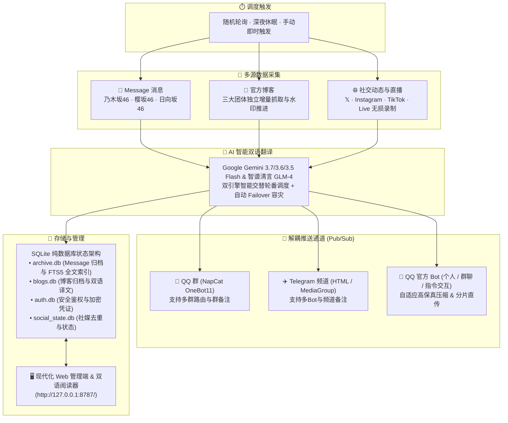
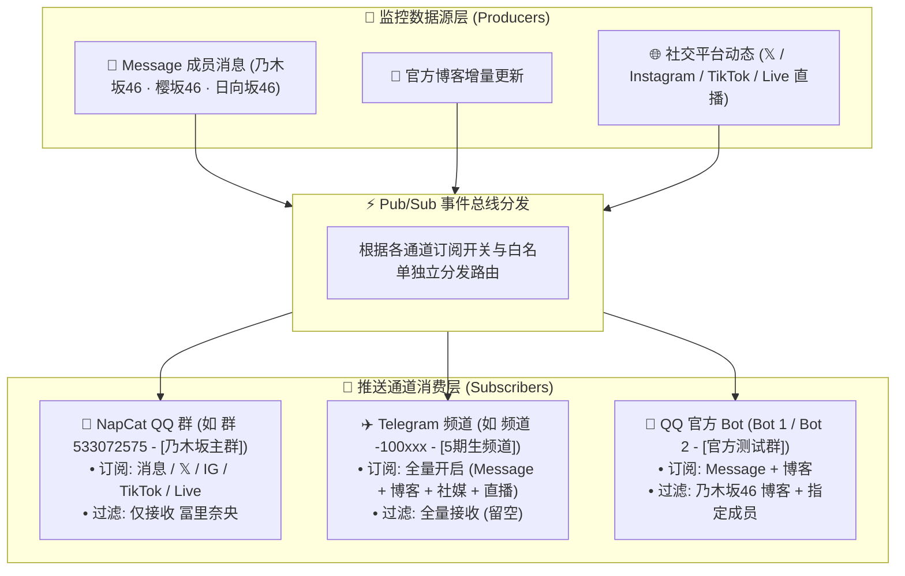
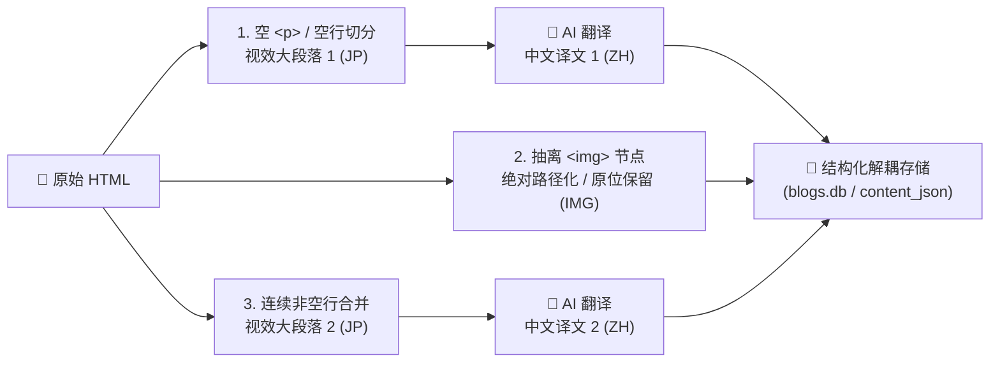

# 🌸 nogizaka-message-push

> **坂道联合（乃木坂46 / 日向坂46 / 櫻坂46）Message 私密消息 & 官方博客 & 社交平台（X / Instagram / TikTok / 直播录制）全自动监控、Google Gemini & 智谱清言 AI 多引擎智能双语翻译、多通道格式化推送与全量本地永久持久化归档系统。**

[](https://www.python.org/)
[](LICENSE)
[]()
[]()
[](https://github.com/astral-sh/ruff)

自动轮询成员 Mobile Message 消息、官方博客更新及**多平台社交媒体（X / Twitter、Instagram、TikTok、TikTok Live 直播自动录制）**，利用 **Google Gemini**（Gemini 3.7 / 3.6 / 3.5 Flash）与 **智谱清言**（GLM-4-Flash）双引擎智能交替轮流翻译（Round-Robin + 自动 Failover 容灾），进行具有偶像口吻与文脉连贯的地道中文翻译，格式化推送到 **QQ 群（NapCat / Lagrange） / Telegram 频道 / QQ 官方开放平台机器人**，并将每条消息、博客与社媒动态连同原图、视频、语音及直播录像**永久归档到本地硬盘与 SQLite 数据库**。成员与 Message 账号现已彻底解耦，亦可自由监控其他偶像社媒与博客；日常运维、账号凭证热更、用户权限管理与归档查阅全部在浏览器端 Web UI 中完成。



---

## 📑 目录

- [1. ✨ 核心特性 / Features](#1--核心特性--features)
- [2. 🐳 Docker / NAS 一键部署 (推荐)](#2--docker--nas-一键部署-推荐)
  - [方式一：Docker CLI 一行运行](#方式一docker-cli-一行运行)
  - [方式二：Docker Compose 编排启动（最推荐）](#方式二docker-compose-编排启动最推荐)
- [3. 🚀 极简快速上手 / Quick Start (原生 Python)](#3--极简快速上手--quick-start-原生-python)
  - [Step 1: 安装依赖与环境准备](#step-1-安装依赖与环境准备)
  - [Step 2: 启动程序（自动生成初始管理员）](#step-2-启动程序自动生成初始管理员)
  - [Step 3: 登录管理后台进行可视化配置](#step-3-登录管理后台进行可视化配置)
  - [💡 忘记密码与系统重置指南](#-忘记密码与系统重置指南)
- [4. 🔑 用户与权限管理体系 / User & Auth System](#4--用户与权限管理体系--user--auth-system)
  - [4.1 双角色模型（admin 与 viewer）](#41-双角色模型admin-与-viewer)
  - [4.2 银行级安全架构与防锁死机制](#42-银行级安全架构与防锁死机制)
  - [4.3 网页端用户管理操作详解](#43-网页端用户管理操作详解)
  - [4.4 命令行管理工具 (tools/manage_users.py)](#44-命令行管理工具-toolsmanage_userspy)
- [5. 🧩 系统核心概念与架构 / Architecture](#5--系统核心概念与架构--architecture)
  - [5.1 监控源与推送通道彻底解耦（Pub/Sub 订阅分发与渠道备注）](#51-监控源与推送通道彻底解耦pubsub-订阅分发与渠道备注)
  - [5.2 单次鉴权下载与本地零开销复用流水线（Single-Download Flow）](#52-单次鉴权下载与本地零开销复用流水线single-download-flow)
  - [5.3 QQ 官方 Bot 自适应压缩与大文件分片直传](#53-qq-官方-bot-自适应压缩与大文件分片直传)
  - [5.4 多平台双模式认证（Web vs Mobile）与全自动握手续期](#54-多平台双模式认证web-vs-mobile与全自动握手续期)
  - [5.5 配置文件三层加载体系与热重载机制](#55-配置文件三层加载体系与热重载机制)
- [6. 🛠️ 博客监控、智能解析与双语阅读器](#6-️-博客监控智能解析与双语阅读器)
  - [6.1 4 列满格网格、期别五十音规范排序与作者检索](#61-4-列满格网格期别五十音规范排序与作者检索)
  - [6.2 智能分段解析与图片原位保护算法](#62-智能分段解析与图片原位保护算法)
  - [6.3 三态多语言视图与数据解耦存储](#63-三态多语言视图与数据解耦存储)
  - [6.4 全渠道 zakablog 规范排版与格式化推送](#64-全渠道-zakablog-规范排版与格式化推送)
- [7. 💬 Message 消息与信件归档与全文检索](#7--message-消息与信件归档与全文检索)
  - [7.1 聚合动态首页、横向画廊与即时关键词搜索](#71-聚合动态首页横向画廊与即时关键词搜索)
  - [7.2 时间线浏览、FTS5 全文搜索与图片 AI 识图打标](#72-时间线浏览fts5-全文搜索与图片-ai-识图打标)
  - [7.3 历史全量消息断点续传回填](#73-历史全量消息断点续传回填)
  - [7.4 粉丝信件 (Fan Letters) 归档与专属画廊](#74-粉丝信件-fan-letters-归档与专属画廊)
- [8. 🌐 社交媒体监控与直播录制 (X / Instagram / TikTok / Live)](#8--社交媒体监控与直播录制-x--instagram--tiktok--live)
  - [8.1 多平台免登录抗封控抓取架构](#81-多平台免登录抗封控抓取架构)
  - [8.2 成员与 Message 账号解耦机制](#82-成员与-message-账号解耦机制)
  - [8.3 TikTok Live 直播探测与 ffmpeg 切片录制](#83-tiktok-live-直播探测与-ffmpeg-切片录制)
  - [8.4 社交媒体与 AI 翻译及多通道推送对接](#84-社交媒体与-ai-翻译及多通道推送对接)
- [9. 🖥️ 网页管理端与日常运维](#9-️-网页管理端与日常运维)
  - [9.1 七大管理页签功能全览](#91-七大管理页签功能全览)
  - [9.2 QQ 官方机器人私聊交互指令](#92-qq-官方机器人私聊交互指令)
- [10. ⚙️ 服务化部署与运维托管](#10-️-服务化部署与运维托管)
  - [10.1 Windows 计划任务后台守护（防孤儿进程）](#101-windows-计划任务后台守护防孤儿进程)
  - [10.2 Linux Systemd 用户级/系统级服务化托管](#102-linux-systemd-用户级系统级服务化托管)
  - [10.3 每日健康摘要（死人开关）与数据备份清单](#103-每日健康摘要死人开关与数据备份清单)
- [11. 🔍 常见故障排查 / FAQ](#11--常见故障排查--faq)
- [12. 📖 附录与配置参考](#12--附录与配置参考)
  - [12.1 全量配置项手册 (config.json)](#121-全量配置项手册-configjson)
  - [12.2 环境变量速查 (.env)](#122-环境变量速查-env)
  - [12.3 命令行工具矩阵 (tools/)](#123-命令行工具矩阵-tools)
  - [12.4 现役成员 ID 速查表](#124-现役成员-id-速查表)
- [13. 📄 开源许可证 / License](#13--开源许可证--license)

---

## 1. ✨ 核心特性 / Features

### 1. 智能博客解析与媒体保护
- **DOM 智能分段与大段落合并**：全面兼容乃木坂46、日向坂46、樱坂46三团官网差异化 DOM 结构。以空 `<p>` 标签作为视效分段标识，智能合并连续 `<p>` / `<div>` 节点为完整大段落并保留段内换行（`\n`），1:1 精准还原官方博客的排版留白与阅读节奏。
- **图片节点抽离与位置保护**：在送交 AI 模型翻译前，预先抽离、标记并保护正文中的 `` 节点，补全绝对 URL 并携带 `referrerpolicy="no-referrer"`，杜绝长篇博客翻译截断与畸形标签导致的图片丢失或位移。
- **4 列非对称满格网格与恒定分页**：首页第 1 页独家采用非对称分页算法加载 25 篇（1 篇 Hero 顶置大卡片 + 24 篇网格，填满 6 行 × 4 列无缺口）；后续页精准衔接 24 篇且无跨页重复，分页总数在所有页面保持绝对恒定准确。
- **破图优雅降级机制**：卡片列表与封面图片遇 404、防盗链拦截或资源损坏时，自动隐藏图片容器并转为优雅占位样式，彻底杜绝浏览器破图图标。

### 2. 智能订阅感知与离线归档守护
- **全自动订阅状态同步**：系统定期自动向官方接口同步各账号的订阅状态，精准识别「活跃订阅 (`active`)」、「曾订阅/离线归档 (`expired`)」、「已关闭/毕业 (`closed`)」与「未订阅 (`unsubscribed`)」。
- **智能调度降载与防误报**：对已到期或未订阅成员，**自动跳过向官方 timeline API 发送无效抓取请求**，保护 API 频次并消除假阳性错误日志，同时完整保留历史离线归档与社媒/博客全量监控。
- **状态微徽章可视化**：管理后台直观呈现「🌟 已订阅 · 至 9/1」、「⏳ 曾订阅 (离线)」、「⚫ 离线/已关闭」等彩色胶囊微徽章，到期时间与在线状态一目了然。

### 3. 多语言视图与解耦架构
- **三档语言视图随心切换**：双语阅读器提供「日中对照」、「日文」、「中文」三种视图模式（未生成译文时自动隐藏切换器，避免误操作）。
- **智能生命周期状态跳转**：
  - 进入博客详情页若已包含译文，默认激活并展示「日中对照」视图；
  - 在当前页面发起即时翻译并收到就绪信号后，自动平滑切换至「日中对照」视图。
- **数据独立持久化存储**：日文原文（原始 HTML）与中文译文解耦独立存储在 SQLite `blogs.db` 中，切换语言直接取独立字段，杜绝单语模式切换导致的内容篡改与丢段问题。

### 4. 视觉排版与全渠道对齐
- **专属中日字体区分规范**：日中对照模式下，**日文原文统一渲染为斜体（Italic）**，**中文译文统一渲染为粗体（Bold）**，主次分明、视觉层次清晰。
- **全渠道排版严格一致**：Web 网页端阅读器与各推送通道（Telegram、QQ 群、QQ 官方 Bot 等卡片/长图）统一执行该排版与字体规范，并自动压缩连续照片占位符为 `[写真1-3]` 形式。
- **全新 Popover 检索与微胶囊滚动条**：归档与博客导航栏搭载常驻主选择器 + 弹出式实时拼音/日文搜索面板，配合支持鼠标滚轮横向滑动的微胶囊滚动条，几十位成员切换秒级直达。

### 5. 翻译来源透明化与多引擎双活
- **AI 模型实时动态标记**：详情页右上角动态显示当前译文生成的 AI 模型名称（如 `Gemini 3.7 Flash` / `GLM-4-Flash` 等），仅在存在译文且处于「日中对照」或「中文」视图时优雅展示。
- **双引擎智能交替调度 (Round-Robin)**：同时配置 Google Gemini 与 智谱清言 API Key 时，系统会在两家大模型之间均匀轮巡调度，并提供秒级 Failover 故障自动切流。

### 6. 极致的稳定性与性能架构
- **毫秒级极速就绪启动**：SQLite 归档搭载快速路径与自愈标记，冷启动时间从 23s+ 骤降至 **<1 秒**，杜绝上万文件重复扫描与 FTS 索引反复重建。
- **开箱即用自动初始化管理员**：系统首次启动自动生成管理员 `admin` 及高强度随机密码并在终端高亮提示，杜绝未授权访问。
- **单次鉴权下载与本地零网络复用**：媒体资源在归档阶段统一鉴权下载落盘，各推送通道直接读取本地文件字节秒级分发，彻底根除 CDN 重复下载与并发冲突。
- **富媒体自适应高保真压缩**：超大长图与视频自动进行 PIL / ffmpeg 高保真优化压缩，完美适配 QQ 官方 Bot 直传限制，杜绝 `40093011` 大小超限错误。
- **SQLite WAL 模式与零依赖 WebUI**：后端采用标准库 asyncio HTTP 服务，零外部前端框架依赖；归档采用 SQLite WAL 模式 + FTS5 全文索引，百万级消息秒级响应。

---

## 2. 🐳 Docker / NAS 一键部署 (推荐)

本项目提供官方多架构 Docker 镜像（支持 `linux/amd64` 和 `linux/arm64`，全面适配群晖 Synology、QNAP、Unraid、1Panel、Portainer、云服务器及树莓派）。镜像内置 `ffmpeg`、`tzdata` 与首次运行自动初始化机制，开箱即用。

### 方式一：Docker CLI 一行运行

```bash
docker run -d \
  --name sakamichi-push \
  --restart unless-stopped \
  -p 8787:8787 \
  -e TZ=Asia/Tokyo \
  -v $(pwd)/config:/app/config \
  -v $(pwd)/data:/app/data \
  -v $(pwd)/logs:/app/logs \
  -v $(pwd)/.env:/app/.env \
  ghcr.io/tomisatonao/nogizaka-message-push:latest
```

### 方式二：Docker Compose 编排启动（最推荐）

1. 创建并进入工作目录：
```bash
mkdir -p sakamichi-push && cd sakamichi-push
```

2. 新建 `docker-compose.yml` 编排文件：
```yaml
services:
  sakamichi-push:
    image: ghcr.io/tomisatonao/nogizaka-message-push:latest
    container_name: sakamichi-push
    restart: unless-stopped
    ports:
      - "8787:8787"
    environment:
      - TZ=Asia/Tokyo
      # 也可以直接在此处注入密钥（或者通过挂载的 .env 填写）：
      # - WEB_ADMIN_TOKEN=your_token
      # - GEMINI_API_KEY=AIzaSy...
      # - ZHIPU_API_KEY=df488...
      # - TG_BOT_TOKEN=123456:ABC...
    volumes:
      - ./config:/app/config
      - ./data:/app/data
      - ./logs:/app/logs
      - ./.env:/app/.env
```

3. 一键启动容器：
```bash
docker compose up -d
```

4. 查看首次启动终端生成的初始管理员账号与随机密码：
```bash
docker logs sakamichi-push
```

5. 打开浏览器访问 **`http://<服务器或NAS IP>:8787/`** 即可直接登录并进行可视化管理！

---

## 3. 🚀 极简快速上手 / Quick Start (原生 Python)

本项目采用**“零手动改配置文件、全 Web 可视化引导”**的极简设计理念，3 步即可完成部署与运行：

### Step 1: 安装依赖与环境准备

需要 **Python 3.10+**（支持 Windows / Linux / macOS）。

```bash
# 1. 克隆代码仓库
git clone https://github.com/TomisatoNao/nogizaka-message-push.git
cd nogizaka-message-push

# 2. 安装核心依赖
pip install -r requirements.txt

# 3. 初始化环境变量文件
cp .env.example .env        # Windows CMD/PowerShell: copy .env.example .env
```

### Step 2: 启动程序（自动生成初始管理员）

```bash
python main.py
```

首次运行时，系统会自动检测并初始化用户库，在终端中高亮输出**初始管理员账号与随机密码**：

```text
======================================================================
🔑 系统首次运行：已为您自动创建初始管理员账号！
   • 用户名:   admin
   • 初始密码: 7Kq9vWx2mP4z
   • Web 管理端: http://127.0.0.1:8787/

⚠️ 请妥善保存初始密码！若遗忘，可在终端执行：
   python tools/manage_users.py passwd admin
======================================================================
```

### Step 3: 登录管理后台进行可视化配置

打开浏览器访问 **`http://127.0.0.1:8787/`**，输入终端中提示的 `admin` 及初始密码登录。

在后台页面中直接完成所有日常配置（全部无需手动修改 JSON）：

1. **配置 AI 翻译**：切换到「⚙️ 系统设置」，点击「填写」录入你的 Google Gemini API Key（可在 [Google AI Studio](https://aistudio.google.com/apikey) 免费获取）或智谱开放平台 API Key（可在 [智谱开放平台](https://open.bigmodel.cn/) 免费获取，GLM-4-Flash 永久免费且国内直连）；同时配置两者将开启**双引擎智能轮流调度与自动容灾**；
2. **开启推送通道**：切换到「📢 推送通道」，开启 Telegram 频道、NapCat QQ 群 或 QQ 官方机器人，设置清晰的「备注」（如 `乃木坂主群`、`5期生频道`），并点击「📨 发送测试」验证连通性；
3. **添加账号与监控成员**：切换到「👥 账号与成员」，点击「填凭证」直接粘贴 Message 抓包的 Token/Cookie，然后点击「📋 从账号拉取成员列表」一键勾选要监控的偶像成员；
4. **即时生效**：点击右上角「⟳ 重新载入」，系统即刻进入全自动抓取、翻译、推送与归档状态！

---

### 💡 忘记密码与系统重置指南

如果你在首次启动时未留意控制台输出的随机密码，或者后续遗忘了密码，可以通过以下官方工具快速解决：

#### 方案 A：直接在终端重置 admin 密码
```bash
# 方式 1：指定新密码（需 ≥ 8 位）
python tools/manage_users.py passwd admin YourNewPass123

# 方式 2：交互式安全输入密码
python tools/manage_users.py passwd admin
```

#### 方案 B：重置用户库初始状态
```bash
# 清空现有用户并重新生成初始 admin 随机密码
python tools/manage_users.py reset

# 或者直接删除鉴权数据库后重启主程序（自动重新生成）：
rm data/auth.db             # Windows: del data\auth.db
python main.py
```

---

## 4. 🔑 用户与权限管理体系 / User & Auth System

系统内置了企业级轻量化用户鉴权与访问控制系统（RBAC），兼顾了**管理端配置的绝对安全性**与**归档查看的便捷分享性**。

### 4.1 双角色模型（admin 与 viewer）

系统采用两级角色模型划分用户权限边界：

| 权限能力 | 👑 管理员 (`admin`) | 👓 访客/查看者 (`viewer`) |
|---|:---:|:---:|
| **登录 Web 管理后台** (`/`) | ✅ 完全允许 | ❌ 严密拦截 (403 友好重定向) |
| **实时状态与通道监控** | ✅ 查看全部健康度与指标 | ❌ 禁止访问 |
| **修改配置与凭证热更** | ✅ 修改配置、填凭证、配置通道 | ❌ 禁止访问 |
| **系统级控制（热重载 / 重启）** | ✅ 一键重启与热更配置 | ❌ 禁止访问 |
| **查看实时脱敏运行日志** | ✅ 实时日志轮询与过滤 | ❌ 禁止访问 |
| **用户与权限管理** | ✅ 增删用户、改密码、分配角色 | ❌ 禁止访问 |
| **访问 Message 消息归档** (`/archive`) | ✅ 完全允许 | ✅ 完整浏览与全文检索 |
| **访问 官方博客归档与双语阅读器** | ✅ 完整浏览 / 即时重译 / 删译文 | ✅ 完整浏览阅读 |

> 💡 **归档免登录公开选项**：如果希望将 `/archive` 开放给同好朋友自由浏览而无需逐一分发账号，只需在「⚙️ 系统设置」中开启 `auth.archive_public: true`，此时管理后台仍强力受密码保护，而归档页可匿名公开访问。

---

### 4.2 银行级安全架构与防锁死机制

1. **scrypt 加盐哈希加密**：
   - 用户密码采用标准库 `hashlib.scrypt` 进行加盐哈希（$N=16384, r=8, p=1$），数据库 `data/auth.db` 中**绝不存储任何明文密码**，即使归档数据泄露也无法逆向还原。
   - 校验逻辑采用 `hmac.compare_digest` 常时比较，彻底免疫针对密码比对的时序侧信道攻击（Timing Attack）。
2. **安全会话生命周期**：
   - 登录成功后签发由 `secrets` 模块生成的强随机 Session Token；
   - 附带 `HttpOnly` 与 `SameSite=Strict` Cookie 保护，免疫 XSS 与 CSRF 劫持；
   - 会话仅驻留进程内存中，修改密码会自动即时踢出该用户的所有已登录会话，主程序重启会话自动失效。
3. **暴力破解防护机制**：
   - 内置基于请求 IP 的异常登录限制。若在 10 分钟内连续输错密码达到 5 次，系统将对该 IP 实施 15 分钟临时锁定并记录安全告警日志。
4. **系统级防锁死（Anti-Lockout）保护**：
   - **禁止删除/降级最后一个管理员**：系统严格禁止删除或将角色降级为 `viewer` 的最后一个 `admin` 账号，确保永远有管理员能登录后台；
   - **禁止删除当前登录账号**：严禁管理员在网页端误操作删除自己正在使用的登录账号。

---

### 4.3 网页端用户管理操作详解

登录 `admin` 账号后，进入顶部导航栏的 **「🔑 用户」** 选项卡即可进行全流程可视化管理：

- **👥 用户列表矩阵**：清晰呈现用户名、当前登录状态标记（绿色 `当前登录` 徽标）、角色标签、账号创建时间及操作按钮；
- **➕ 添加新用户**：输入用户名，选择角色（`admin` / `viewer`），可手动输入密码或点击「🎲 随机生成」一键生成 12 位高强度安全密码；
- **🔑 在线修改密码**：管理员可随时为自己或其它用户重置新密码，修改后旧会话立即失效；
- **🛡️ 角色变更与注销**：灵活切换成员权限，具备二次确认与防锁死拦截保护。

---

### 4.4 命令行管理工具 (tools/manage_users.py)

无需启动 Web 服务，在服务器终端即可通过 `tools/manage_users.py` 完整管理账号体系：

```bash
# 1. 查看现有所有用户列表
python tools/manage_users.py list

# 2. 新增管理员用户（交互式输入密码）
python tools/manage_users.py add alice

# 3. 新增仅归档查看者用户（viewer）
python tools/manage_users.py add bob --viewer

# 4. 修改/重置指定用户密码（支持直接传参或留空交互式输入）
python tools/manage_users.py passwd alice NewSecurePassword888

# 5. 调整用户角色权限
python tools/manage_users.py role bob admin     # 提升为管理员
python tools/manage_users.py role bob viewer    # 调整为查看者

# 6. 删除用户
python tools/manage_users.py del bob

# 7. 重置系统初始状态（清空用户库并生成全新的 admin 随机密码）
python tools/manage_users.py reset
python tools/manage_users.py reset --force     # 免确认静默重置
```

---

## 5. 🧩 系统核心概念与架构 / Architecture

### 5.1 监控源与推送通道彻底解耦（Pub/Sub 订阅分发与渠道备注）



- **全渠道备注支持（Remark）**：
  - NapCat 群路由、Telegram Bot 与 QQ 官方 Bot 均原生支持自定义 `remark` 字段（如 `乃木坂主群`、`5期生频道`）；
  - Web 管理端表格与订阅规则弹窗中醒目显示 `群备注 (群号)` / `备注 (Bot名)`，多群多 Bot 分发时一目了然。
- **数据生产端（监控源）**：
  - **Message 账号池与成员**：支持指定账号抓取成员消息，亦支持「无账号纯监控」成员；
  - **官方博客**：三大团体（乃木坂46 / 樱坂46 / 日向坂46）独立抓取与增量更新；
  - **社交媒体**：𝕏 (Twitter)、Instagram、TikTok 短视频与 TikTok Live 直播录制，纯账号驱动监控，无需与任何成员强制绑定。
- **数据消费端（推送通道）**：
  - **NapCat OneBot11 群路由**、**Telegram Bots** 与 **QQ 官方机器人** 均作为独立的订阅者；
  - 每个通道支持独立定制 **6 种内容类型订阅开关**（Message、博客、𝕏、IG、TikTok 视频、直播）及 **3 类精细白名单过滤器**（`member_filter`、`blog_filter`、`social_filter`）。

---

### 5.2 单次鉴权下载与本地零开销复用流水线（Single-Download Flow）

针对坂道 Message 托管在 CloudFront 上的私有加密媒体资源（`/private/messages/files/...`），系统重构了全链路流式管线：

```
收到新消息
   ↓
1. AI 双引擎智能翻译
   ↓
2. 【归档模块】自动挂载账号凭据 Headers 从 CloudFront 统一鉴权下载媒体到本地磁盘（仅 1 次网络请求）
   ↓
3. 【推送模块】QQ 官方 Bot / TG Bot 检查本地已有归档，直接读取磁盘字节（0 网络请求，0 耗时）
   ↓
4. 上传并分发至各推送渠道，完成通知
```
- **杜绝并发竞争与 403 异常**：归档下载时通过 `get_source_headers_for_account` 携带完整认证请求头，杜绝 CloudFront 拦截；
- **带宽节省 50%**：同一条消息的多媒体仅在入库时下载一次，后续推送 100% 复用本地磁盘素材。

---

### 5.3 QQ 官方 Bot 自适应压缩与大文件分片直传

针对腾讯 QQ 官方开放平台富媒体文件传输限制，系统内置双轨上传机制：
1. **直接上传模式 (`/files`)**：Base64 编码直接嵌入 JSON 请求体。当图片体积 > 2.8MB 时，系统自动通过 PIL 启动**自适应高保真微损/无损优化压缩**，在肉眼完全看不出画质损耗的前提下将体积控制在 2.5MB 内，彻底杜绝腾讯服务端返回 `HTTP 400 | code: 40093011 (上传文件大小超过限制)` 错误；
2. **大文件分片直传模式 (`upload_prepare` -> COS 分片)**：大视频（> 7.8MB）或超大文件自动启用腾讯云 COS 分片直传，最大支持 200MB 高清视频原画质发送。

---

### 5.4 多平台双模式认证（Web vs Mobile）与全自动握手续期

1. **认证模式与平台分发**：
   - `web` 模式（默认）：模拟 Chrome 桌面端，依赖 Token 与 Cookie，支持乃木坂46、樱坂46、日向坂46及 **Yodel 平台**；
   - `mobile` 模式：模拟 iOS 客户端，使用 `refresh_token` 自动向鉴权中心换取短期 JWT，免去 Cookie 过期困扰；
   - `yodel` 平台支持：全面支持日向坂46 / 樱坂46 新版 Yodel 应用 cURL 凭证一键解析、动态域名识别与自动端点适配。

2. **📖 Web 端 0 等待登录凭证抓取与自动续期操作手册**：
   > 💡 **原理提示**：乃木坂 / 樱坂 / 日向坂官方将核心 `session` Cookie 限定于 `Path=/v2/update_token` 路径下，普通消息列表（`timeline`）不会携带此 Cookie。该 Cookie 的唯一下发源头是登录瞬间的 `POST /v2/signin` 接口。利用本系统内置的智能解析器，您可以在登录完成的**第 0 秒**直接完成全套凭证捕获与永久自动续期！

   - **Step 1（准备抓包）**：按 `F12` 打开浏览器开发者工具 ➔ 切换到 **Network（网络）** 面板 ➔ **务必勾选顶部的「Preserve log」（保留日志）**；
   - **Step 2（完成登录）**：访问对应团体的 Web 官网（如 `https://message.nogizaka46.com/` / `https://message.sakurazaka46.com/` / `https://message.hinatazaka46.com/`）或 Yodel 网页端正常完成 Google / Apple / Line 账号登录；
   - **Step 3（一键复制 cURL 凭证）**：登录成功后，在 Network（网络）面板中通过以下任一方式复制：
     - **方式 A（全量复制，最省心推荐）**：在 Network 请求列表任意空白处或请求上右键 ➔ **「Copy」➔「Copy all as cURL (bash)」** 或 **「Copy all as cURL (cmd)」**；
     - **方式 B（精准复制单请求）**：在 Network 顶部筛选框输入 `signin` ➔ 找到 **`POST signin`** 请求 ➔ 右键 **「Copy」➔「Copy as cURL (bash / cmd)」**；
   - **Step 4（智能解析与保存）**：
     - 打开本系统 Web 管理端（`http://127.0.0.1:8787/`）➔ 进入「👥 账号与成员」卡片 ➔ 点击目标账号的 **「填凭证」**；
     - 展开顶部的 **「📋 智能一键解析」** ➔ 将复制的内容直接粘贴进文本框 ➔ 点击 **「🚀 解析并填充」**；
     - 系统内置的深度解析器将自动清洗命令行转义字符，智能提炼最新的 `access_token`、动态域名（如 `api.yodel-app.com`）与长达 30 天可循环顺延的持久 `session` Cookie；
     - 点击 **「🔐 保存并自动握手」**，系统立刻完成安全握手与长期托管，从此以后每小时全自动无感续期，永不过期！

3. **主动式寿命探测与自动续期**：
   - 每次巡查前解码 JWT 并检查 `exp` 寿命，若剩余不足 300 秒则自动发起静默续期；
   - 抓取遭遇 401 Unauthorized 时，自动触发指数退避刷新与被动重试机制；
   - 在 WebUI 账号列表操作栏可随时点击「⚡ 握手测试」验证连通性并查看 Token 剩余有效时长。

4. **凭证加载优先级**：
   ```
   SQLite 加密凭证库 (data/auth.db)  >  环境变量 (.env)  >  默认配置
   ```

---

### 5.5 配置文件三层加载体系与热重载机制

系统采用 **内置默认值 ➔ `config.json` 覆盖 ➔ `.env` 敏感密钥注入** 的三层分级架构。底层集成文件观察者（Watchdog），在不重启进程的前提下实现：
- 增删监控成员与账号即时生效；
- 推送通道开关、API 与备注即时热更新；
- 官方 Bot 列表与指令监听任务动态增减。

---

## 6. 🛠️ 博客监控、智能解析与双语阅读器

本系统深度集成坂道三团官方博客爬虫，提供**抓取 ➔ 结构化解耦 ➔ AI 翻译 ➔ 高清下载 ➔ 优雅阅读**全链路方案：

### 6.1 4 列满格网格、期别五十音规范排序与作者检索

- **4 列非对称满格响应式矩阵**：首页第 1 页独家采用非对称分页加载 25 篇（1 篇 Hero 顶置精选大卡片 + 24 篇小卡片，填满 6 行 × 4 列无缺口）；后续页精准衔接 24 篇且无跨页重复，分页总数恒定精准。
- **期别与五十音（あいうえお順）规范排序**：作者列表严格对齐坂道官方规范体系，按「**期别个人成员（按期别升序，期内严格按五十音读音） ➔ 期别整体账号/接力博客 ➔ Staff / 运营事务局 / 吉祥物（如 ポカ）**」分层呈现，告别杂乱拼音排序。
- **博客作者搜索下拉卡片（Author Popover）**：在博客列表上方常驻 `[ 👥 全部成员 (36位) ▾ ]`，点击展开带实时拼音/日文过滤的搜索面板，并附带成员官方头像（含吉祥物 ポカ 官方特约写真）与篇数统计，秒级直达目标成员。
- **作者微胶囊滚动条（Carousel Scroller）**：单行展示 30+ 成员紧凑微胶囊，支持左右微滚动按钮与鼠标滚轮直接横向平滑滑动。
- **破图优雅降级**：封面遇 404、防盗链拦截或原图下架时，前端自动隐藏破损图片节点并以 📝 极简图标占位，视觉整洁一致。
- **日期跳转与日历热力**：左侧吸顶日历按日统计博客发文量，点击任意日期自动重置筛选并精准定位高亮目标博客。

### 6.2 智能分段解析与图片原位保护算法



- **5 类 DOM 统一归一化**：自动消除 `<br>` 堆叠、逐行 `<p>` 碎片化与 `<div>` 容器差异，确保段落粒度与人类视效完全一致。
- **原位节点保留**：图片不参与纯文本翻译，预先抽离并在拼接时无损插回原位，彻底根除漏图、跳段与长文截断现象。

### 6.3 三态多语言视图与数据解耦存储

双语阅读器内置自由切换机制：

| 视图模式 | 渲染逻辑 | 适用场景 |
|---|---|---|
| **📖 日中对照** (默认) | 日文段落（*斜体*）与中文译文（**粗体**）交替插值渲染，图片原位嵌入 | 最佳双语精读体验 |
| **🇯🇵 仅日文** | 100% 渲染官网原始 `body_html`，保留原汁原味排版与样式 | 原文核对、生词学习 |
| **🇨🇳 仅中文** | 提取纯中文段落并原位保留图片；若某段无译文自动优雅降级回退至日文 | 快速通读流览 |

- **翻译模型动态溯源**：详情页右上角次级灰字动态标示 `翻译模型：gemini-3.7-flash` 或 `glm-4-flash`。
- **管理员一键管理**：登录 Admin 后可在阅读器内随时「🗑️ 删除翻译」或「🌐 即时重译」。

### 6.4 全渠道 zakablog 规范排版与格式化推送

#### 1. 官方博客推送（zakablog 标准排版规范）
博客推送全渠道（Telegram / QQ 群 / 官方 Bot）严格统一按照 **zakablog 标准排版规范** 发送：
1. **Header 信息头**：团体 Emoji、成员名、标题、发布时间、**AI 翻译模型溯源（如 `模型：glm-4-flash` / `模型：gemini-3.7-flash`）**、原图统计与原文链接；
2. **全量高清原图 / 长图卡片**：支持多图推送或 Playwright 渲染的精美长图卡片（具备智能阶梯体积控制）；
3. **双语对照正文**：日文 *斜体*、中文 **粗体**；连续图片占位符智能归并为 `[写真1-3]`，自动转义特殊 Markdown 符号。

#### 2. Message 私聊消息推送排版（居中徽章分隔线）
Message 私密消息采用结构清晰的日中对照排版，日文原文与中文译文之间嵌入 AI 模型来源徽章：
```text
🌸 冨里奈央 08/14 12:30:00
こんにちは！今日もすっごく暑いね〜☀️

─── 🌐 译文 (glm-4-flash) ───

大家中午好！今天真的超级热呢〜☀️
```
- **双引擎智能轮流调度**：系统在 Google Gemini 与 智谱清言 之间交替轮流翻译，徽章自动对应本次调用的模型名称；
- **全通道自适应**：在 NapCat QQ 群、Telegram 频道及 QQ 官方机器人下均完美呈现。

---

## 7. 💬 Message 消息归档与全文检索

### 7.1 聚合动态首页、横向画廊与即时关键词搜索

访问 `/archive` 即可进入跨成员聚合首页：
- **🔍 消息正文与译文即时搜索**：归档顶栏配备关键词搜索框，输入即时（350ms 防抖）对所有历史消息的原文、中文译文及媒体文件名进行模糊检索，支持回车直达与多维筛选联动。
- **全员搜索下拉卡片（Searchable Member Popover）**：顶栏常驻当前选中成员选择器，点击展开带实时拼音/日文搜索框的全员面板，秒级直达任意成员。
- **微胶囊横向滚动条（Chips Carousel）**：精巧展示各成员微胶囊与格式化消息总数（如 `5.6k`，悬浮显示精确数值），配备左右翻页按钮并支持鼠标滚轮横向滚动。
- **Hero 卡片**：直观展示全站归档总数、时间跨度、本周收发环比及「今日 X 条」一键准确定位跳转。
- **最新写真横向画廊**：轮播展示最新抓取的高清生写与日常随拍，支持键盘方向键翻页与全屏灯箱。
- **最近动态流**：聚合展示各成员最新 Message 气泡与双语译文。

### 7.2 时间线浏览、FTS5 全文搜索与图片 AI 识图打标

- **聊天气泡时间线**：按天精准分隔（JST 时间），支持日中双语对照、音频在线播放、视频流媒体拖拽进度。
- **毫秒级极速冷启动**：内置智能快速检查路径与时区对齐标记，将上万条历史记录的 SQLite 加载与 FTS 索引就绪时间从 23 秒缩短至 **<1 秒**。
- **SQLite FTS5 全文检索**：毫秒级秒搜数万条历史消息，支持空格多词分词与中日双语联合匹配。
- **Gemini Vision 智能打标**：自动对收到的图片进行 10 种类目识别（自拍/合照/舞台/外出/美食/玩偶/动物/花草/风景/截图），点击标签即可一键聚合检索。

### 7.3 历史全量消息断点续传回填

实时归档仅覆盖启用之后的新消息，历史消息使用内置回填工具一键补全：

```bash
# 回填全量成员的历史全部消息（自动断点续传）
python tools/backfill_archive.py

# 指定成员与起始日期回填
python tools/backfill_archive.py 冨里奈央 --from 2023-01-01
```

### 7.4 粉丝信件 (Fan Letters) 归档与专属画廊

支持归档并持久化你在各坂道 Message 官方应用中给偶像发送的**全部粉丝信件（レター）**：

- **高清信纸卡片原图保存**：从官方 Private CDN（CloudFront）下载并无损存储生成的高清信纸长图（`data/archive/{成员名}/letters/{时间戳}_{letter_id}.jpg`）；
- **SQLite 结构化持久化与 letters.json**：自动将信件 ID、正文字数、JST 发送时间戳、是否收藏标记（`is_favorite`）及本地图片路径写入 `archive.db` 的 `letters` 表与本地 `letters.json`；
- **WebUI 专属画廊与沉浸式灯箱**：在 Web 管理端提供「✉️ 信件」独立专区，支持按三坂分组切换成员、卡片流式网格展示、文字展开/折叠、高清信纸原图全屏灯箱缩放与键盘 `◀`/`▶` 翻页；
- **增量同步与权限隔离**：信件管理与 API 默认仅对 `admin` 管理员开放（对普通 `viewer` 角色完全隐藏），支持 Web 端一键「🔄 同步信件」与差异化增量反馈；
- **独立命令行工具**：
  ```bash
  # 增量归档指定成员的粉丝信件
  python tools/archive_letters.py 冨里奈央

  # 增量扫描并归档所有监控成员的信件
  python tools/archive_letters.py
  ```

---

## 8. 🌐 社交媒体监控与直播录制 (X / Instagram / TikTok / Live)

本项目集成了全自动偶像社交媒体监控系统（移植自社媒采集引擎 `ban` 并深度重构），实现对 **𝕏 (Twitter)、Instagram (Feed/Story/Reels)、TikTok (短视频/图文) 与 TikTok Live 直播** 的 24 小时无人值守巡查与自动无损录制。

### 8.1 多平台免登录抗封控抓取架构

| 平台 | 抓取技术与抗风控设计 | 原图与多媒体处理 |
|---|---|---|
| **𝕏 (Twitter)** | 免登录 Syndication API ➔ Nitter 实例 ➔ 官方 API v2 三级自动降级容灾 | 自动将图片 URL 改写为 `?name=orig` 获取原图无损直链；自动提取图片无障碍 `alt_text` 描述并送交 AI 翻译 |
| **Instagram** | 模拟移动端 GraphQL + Web 前端状态树解析；内置 `ig_safety.py` 安全限频闸门（小时配额硬顶 + 请求间隔抖动 + 6 小时熔断冷却） | 支持 Feed 轮播多图（Carousel）、Reels 短视频与 24h 快拍（Story，需配置 Session ID） |
| **TikTok** | 通过 `embed` 页面绕过主页高强度 WAF 拦截；采用 `(item_id >> 32)` 位移算法离线还原精确毫秒发布时间戳 | 支持短视频、图文幻灯片及原声音频提取与下载 |
| **TikTok Live** | 单次请求仅 **~120 字节、0.3s** 的超轻量开播探测，支持 8s 高频低负载巡查 | 开播瞬间毫秒级捕获 HLS/FLV 流，自动拉起 ffmpeg 混流无损切片录制 |

### 8.2 成员与 Message 账号解耦机制

为了满足跨团体、跨平台偶像应援需求（如**监控没有 Message 账号的毕业成员、48系、指原系 =LOVE/≠ME/≒JOY 或其他三次元艺人**），系统实现了**成员对象与 Message 账号池的彻底解耦**：

1. **监控纯社媒/博客偶像（无需 Message 账号）**：
   在 `config.json` 的 `monitor` 中，`account` 与 `id` 字段均为可选。当 `account` 为空时，系统会自动跳过 Message 抓取，仅监控其绑定的社交账号与官方博客：
   ```json
   {
     "monitor": [
       {
         "name": "指原莉乃",
         "social": {
           "x": ["345__chan"],
           "instagram": ["345insta"]
         }
       },
       {
         "id": "55",
         "name": "冨里奈央",
         "account": "nogizaka_main",
         "social": {
           "instagram": ["tomisato.nao_official"]
         }
       }
     ]
   }
   ```
2. **全局统一监控池**：
   亦可在 `platforms` 分区中直接配置需要监控的账号列表，系统会自动聚合所有账号并自动匹配对应成员的展示名。

### 8.3 TikTok Live 直播探测与 ffmpeg 切片录制

- **8 秒轻量心跳探测**：系统以后台守护线程独立轮询直播接口，单次握手网络包极小，完全不影响 Message 主轮询节奏；
- **自动混流无损切片**：探测到开播后，自动以独立进程组拉起 `ffmpeg`，将直播流无损封装为 MP4 文件（默认每 30 分钟自动分片保存至 `data/social_media/tiktok_live/`）；
- **优雅停机与 Moov Atom 保护**：下播或手动停止时，通过向 ffmpeg 进程发送 `CTRL_BREAK` / `q` 信号优雅收尾，确保 MP4 头部索引完整可播；
- **全通道即时广播**：录制完成或开播时，自动将开播通知、录像文件体积、分片数量及保存路径推送到 Telegram、NapCat QQ 群及 QQ 官方机器人。

### 8.4 社交媒体与 AI 翻译及多通道推送对接

所有抓取到的社交动态（正文及图片 Alt 描述）自动接入本项目的 **AI 多模型智能翻译** 与 **多路由广播系统**：
- **AI 翻译**：针对社媒特有排版（保留 Emoji、保留 Hashtag、不润色长句）定制专属 Prompt，由 Gemini / 智谱 GLM-4 轮流翻译；
- **全通道分发**：自动生成 Telegram HTML 富文本、NapCat OneBot11 图文多媒体消息链以及 QQ 官方机器人 C2C 通知；
- **状态去重与归档**：使用独立 SQLite 状态库（`data/social_state.db`）实现跨轮次幂等去重与断点续存，推文自动持久化至 `data/archive.db`。

---

## 9. 🖥️ 网页管理端与日常运维

管理后台监听于 **`http://127.0.0.1:8787/`**，包含七大核心模块：

### 9.1 七大管理页签功能全览

> 🧭 **管理后台七大功能页签**：`📊 状态` ｜ `👥 账号与成员` ｜ `📢 推送通道` ｜ `🌐 动态监控` ｜ `⚙️ 系统设置` ｜ `🔑 用户` ｜ `🛠️ 高级`

| 页签 | 功能覆盖与亮点 |
|---|---|
| **📊 状态** | 实时查看巡查轮次、倒计时、账号 Token 剩余有效期、通道健康度；提供「立即巡查」与「测试推送」快捷入口。 |
| **👥 账号与成员** | 账号池增删改、凭证即时粘贴更新（支持三团与 Yodel）；**成员监控表格水平平齐排版**；**实时订阅状态与到期时间胶囊（🌟 已订阅 · 9/1、⏳ 曾订阅 (离线)、⚫ 离线/已关闭、⚪ 未订阅）**；未订阅/曾订阅离线成员**智能跳过无效轮询抓取以节约配额**；支持成员与账号解耦（选择「(无)」纯社媒监控）。 |
| **📢 推送通道** | 集中管控 NapCat QQ、Telegram、QQ 官方 Bot 等通道开关、API 接口、**通道直观备注名编辑**、推送路由与独立成员/博客过滤规则。 |
| **🌐 动态监控** | **全平台动态抓取总控**：集中管理官方博客（三团独立开关/频率）、𝕏 (Twitter)、Instagram (Feed/Story/Session ID)、TikTok 短视频与 TikTok Live 直播录制的监控开关、轮询频率与安全限频配置。 |
| **⚙️ 系统设置** | Message 轮询节奏（日间/深夜/休眠时段）、AI 多模型翻译参数与密钥、本地多媒体归档、每日健康报告及 Web 管理端配置。 |
| **🔑 用户** | 采用 scrypt 加盐哈希的用户鉴权系统，在线增删用户、分配角色、生成随机高强度密码（防锁死保护）。 |
| **🛠️ 高级** | 实时脱敏运行日志控制台（支持过滤与清空）、全局 JSON 配置可视化编辑及 **10 份历史快照一键回滚**。 |

### 9.2 QQ 官方机器人私聊交互指令

启用 QQ 官方 Bot 并开启指令后，授权用户在 QQ 私聊机器人即可发送查询指令（回复走被动消息，不消耗主动额度）：

| 指令 | 说明 |
|---|---|
| `/help` | 查看支持的指令帮助菜单 |
| `/status` | 实时查看系统运行时间、巡查轮次、各账号 Token 剩余与异常告警 |
| `/members` | 查看当前监控的所有成员及其绑定的推送通道与备注 |
| `/latest [成员名] [条数]` | 调取指定成员最新的 Message 消息（默认 5 条） |
| `/search <关键词>` | 全归档双语检索并返回最近 5 条匹配结果 |
| `/stats` | 统计各成员的历史归档总量与月份跨度 |

---

## 10. ⚙️ 服务化部署与运维托管

### 10.1 Windows 计划任务后台守护（防孤儿进程）

针对 Windows 生产环境，项目内置了具备崩溃自拉起、防孤儿进程的 PowerShell 守护脚本：

```powershell
# 以管理员权限打开 PowerShell，运行以下命令：
powershell -ExecutionPolicy Bypass -File tools\install_autostart.ps1 -Start     # 安装自启计划任务并立即拉起
powershell -ExecutionPolicy Bypass -File tools\install_autostart.ps1 -Status    # 查看守护进程运行状态
powershell -ExecutionPolicy Bypass -File tools\install_autostart.ps1 -Stop      # 优雅停机（不留孤儿进程）
powershell -ExecutionPolicy Bypass -File tools\install_autostart.ps1 -Uninstall # 卸载开机自启
```

### 10.2 Linux Systemd 用户级/系统级服务化托管

针对 Linux 服务器环境，提供一键注册为 systemd 守护服务的脚本：

```bash
# 用户级守护服务（推荐，无需 root，自动开启 linger 开机启动）
bash tools/install_systemd.sh
bash tools/install_systemd.sh --status
bash tools/install_systemd.sh --logs       # 查看实时 journal 日志
bash tools/install_systemd.sh --stop       # 停止服务
```

### 10.3 每日健康摘要（死人开关）与数据备份清单

- **死人开关 (Daily Summary)**：每日设定时间（默认 JST 23:00）向指定通道推送运行日报。如果某天未收到日报，即说明系统出现异常。
- **核心数据备份清单**：
  - `data/archive/`：历史 Message 归档、媒体文件与 `archive.db` 数据库（**最重要数据，建议定期冷备份**）；
  - `data/blog_data/` 与 `data/blog_images/`：博客数据库与本地下载的博客写真；
  - `data/social_state.db`：社交媒体去重与直播录制会话状态库；
  - `data/auth.db`：用户鉴权、Web 会话与账号加密凭证数据库；
  - `config/config.json` 与 `.env`：系统配置与密钥凭证。

---

## 11. 🔍 常见故障排查 / FAQ

| 故障现象 | 潜在排查原因 | 解决方案 |
|---|---|---|
| **启动时没看清初始管理员密码** | 终端输出被刷过或未留意。 | 执行 `python tools/manage_users.py passwd admin <新密码>` 直接重设，或执行 `reset` 重置。 |
| **启动提示「没有任何可用推送目标」** | 未在「📢 推送通道」中配置任何有效的推送渠道（NapCat / Telegram / QQ 官方 Bot）。 | 进入「📢 推送通道」开启对应 Bot/通道，并在「订阅与过滤规则」中配置接收规则。 |
| **Telegram 报错 `Chat not found`** | Bot 未加入目标频道，或未被赋予「发布消息」管理员权限。 | 将 Bot 添加至频道 Admin；使用 [@getidsbot](https://t.me/getidsbot) 获取准确的频道 Chat ID。 |
| **NapCat 提示连接失败** | OneBot 框架未启动，或 `napcat_api` 地址配置有误。 | 确认 NapCat 运行中，且 HTTP API 地址（如 `http://127.0.0.1:3000`）可正常访问。 |
| **QQ 官方 Bot 报错 `40093011 (上传文件大小超过限制)`** | 博客长图或大图片直接 Base64 上传超过了腾讯 ~3MB 接口限制。 | 新版已集成 **PIL 自适应高保真压缩** 与分片直传，自动将图片限制在安全阈值内。 |
| **Token 频繁报错过期或 401** | Web 凭证 Cookie 失效或账号在多处登录发生冲突。 | 重新抓包获取最新凭证，在 WebUI「账号与成员」中点击「填凭证」更新。 |
| **消息/博客/社媒有原文但无译文** | API Key 未配置，或单家 API 触发了频控限额。 | 在「⚙️ 系统设置」中检查并补充 Google Gemini API Key 或 智谱 API Key（支持两家混合轮流调用）。 |
| **Instagram Story 快拍无法抓取** | 未配置 Instagram Session ID 导致被限登录阻拦。 | 登录网页版 Instagram 复制 Cookie 中的 `sessionid`，在 WebUI「社交监控」填报。 |
| **改了 `.env` 但未生效** | 数据库已持久化有效会话凭证（`data/auth.db`）。 | 推荐直接在 WebUI「账号与成员」卡片中点击「填凭证」在线握手并自动同步更新。 |
| **博客列表封面出现破图** | 官方 CDN 开启了防盗链或原图链接失效。 | 新版已集成自动过滤与占位降级机制，更新代码后自动恢复整洁样式。 |

---

## 12. 📖 附录与配置参考

### 12.1 全量配置项手册 (config.json)

| 配置节点 | 类型 | 默认值 | 详细说明 |
|---|:---:|:---:|---|
| `channels.napcat` | `bool` | `true` | 是否启用 NapCat / Lagrange QQ 群消息推送 |
| `channels.tg` | `bool` | `false` | 是否启用 Telegram 频道 / 机器人消息推送 |
| `channels.qq_official` | `bool` | `false` | 是否启用 QQ 官方开放平台机器人推送 |
| `napcat_api` | `string` | `"http://127.0.0.1:3000"` | NapCat HTTP API 服务监听地址 |
| `napcat_routes` | `array` | `[]` | NapCat 群分发路由（支持 `group_id`, `remark`, `push_message`, `push_blog`, `push_x`, `push_instagram`, `push_tiktok`, `push_live`, `member_filter`, `blog_filter`） |
| `tg_bots` | `array` | `[]` | Telegram Bot 列表（支持 `name`, `target_chat`, `remark`, `push_message`, `push_blog`, `push_x`, `push_instagram`, `push_tiktok`, `push_live`, `member_filter`, `blog_filter`） |
| `qq_official_bots` | `array` | `[]` | 官方 Bot 列表（支持 `name`, `app_id`, `target_openid`, `group_openid`, `remark`, `push_message`, `push_blog`, `member_filter`, `blog_filter`） |
| `web_admin.enabled` | `bool` | `true` | 是否启动 Web 管理端后台 |
| `web_admin.host` | `string` | `"127.0.0.1"` | Web 管理端监听地址（若需要局域网访问可设为 `"0.0.0.0"` 并启用 auth） |
| `web_admin.port` | `int` | `8787` | Web 管理端监听端口 |
| `archive.enabled` | `bool` | `true` | 是否开启 Message 本地归档与持久化 |
| `archive.media` | `bool` | `true` | 是否下载 Message 配套图片、语音与视频媒体至本地 |
| `blog_monitor.enabled` | `bool` | `true` | 是否全局开启官方博客抓取与监控 |
| `blog_monitor.nogizaka` | `bool` | `true` | 乃木坂46 官方博客监控开关 |
| `blog_monitor.hinatazaka` | `bool` | `true` | 日向坂46 官方博客监控开关 |
| `blog_monitor.sakurazaka` | `bool` | `true` | 櫻坂46 官方博客监控开关 |
| `platforms.x.enabled` | `bool` | `false` | 𝕏 (Twitter) 动态监控全局开关 |
| `platforms.x.interval_seconds` | `int` | `60` | 𝕏 白天巡查间隔（秒） |
| `platforms.x.accounts` | `array` | `[]` | 𝕏 监控用户名列表（如 `["nogizaka46", "sakurazaka46"]`） |
| `platforms.instagram.enabled` | `bool` | `false` | Instagram (Feed / Story / Reels) 监控全局开关 |
| `platforms.instagram.interval_seconds` | `int` | `1800` | Instagram 巡查间隔（秒，建议 >= 1800s 避开风控） |
| `platforms.instagram.include_stories` | `bool` | `true` | 是否监控并抓取 24h 快拍 Story（需配置 Session ID） |
| `platforms.instagram.accounts` | `array` | `[]` | Instagram 监控用户名列表（如 `["tomisato.nao_official"]`） |
| `platforms.tiktok.enabled` | `bool` | `false` | TikTok 短视频监控全局开关 |
| `platforms.tiktok.interval_seconds` | `int` | `120` | TikTok 短视频巡查间隔（秒） |
| `platforms.tiktok.accounts` | `array` | `[]` | TikTok 监控用户名列表 |
| `platforms.tiktok_live.enabled` | `bool` | `false` | TikTok Live 直播探测与无损录制开关 |
| `platforms.tiktok_live.interval_seconds` | `int` | `8` | TikTok Live 探测心跳频率（秒，超轻量 120 字节） |
| `platforms.tiktok_live.accounts` | `array` | `[]` | TikTok Live 直播监控用户名列表 |
| `day_interval` | `[int, int]` | `[120, 180]` | 白天轮询随机间隔范围（单位：秒） |
| `night_interval` | `[int, int]` | `[1500, 1800]` | 深夜轮询随机间隔范围（单位：秒） |
| `sleep_hours` | `[int, int]` | `[2, 7]` | 休眠时段范围（JST 日本标准时间小时） |
| `translate` | `bool` | `true` | 是否开启 AI 智能双语翻译 |
| `gemini_models` | `array` | `[...]` | 多引擎模型池列表（Google Gemini + 智谱清言 GLM-4 智能轮番调度与 Failover 备选序列） |
| `gemini_min_interval` | `float` | `7.0` | 翻译请求并发最小间隔保护（秒） |
| `image_tagging` | `bool` | `true` | 是否启用 Gemini Vision 消息图片自动打标签 |
| `daily_summary.enabled` | `bool` | `true` | 每日运行健康报告日报开关 |
| `daily_summary.hour` | `int` | `23` | 日报推送时间（JST 小时） |
| `auth.enabled` | `bool` | `false` | Web 管理端多用户登录鉴权开关 |
| `auth.archive_public` | `bool` | `false` | 是否允许免登录公开查阅 `/archive` 归档 |
| `auth.session_hours` | `int` | `24` | 登录会话 Token 有效期（小时） |

### 12.2 环境变量速查 (.env)

```bash
# Google Gemini API Key（可在 Google AI Studio 免费获取）
GEMINI_API_KEY=AIzaSy...

# 智谱开放平台 API Key（GLM-4-Flash 永久免费，国内免翻直连）
ZHIPU_API_KEY=df488cc9484f46488045...

# Telegram Bot Token
TG_BOT_TOKEN=123456:ABC-DEF

# 网页管理端 API Token (可选，外部脚本调用凭证)
WEB_ADMIN_TOKEN=your_secure_token

# 账号凭证格式：{账号ID大写}_TOKEN / _COOKIE / _REFRESH_TOKEN
NOGIZAKA_MAIN_TOKEN=eyJ...
NOGIZAKA_MAIN_COOKIE=session=xxx
NOGIZAKA_MAIN_REFRESH_TOKEN=

# QQ 官方 Bot 密钥：{Bot名称大写}_CLIENT_SECRET
QQ_OFFICIAL_BOT1_CLIENT_SECRET=your_secret_here

# 社交媒体凭证（可选，用于突破风控或抓取 24h 快拍）
INSTAGRAM_SESSIONID=123456789%3Axxx
X_AUTH_TOKEN=
TIKTOK_SESSIONID=
```

### 12.3 命令行工具矩阵 (tools/)

| 脚本文件 | 命令示例 | 功能说明 |
|---|---|---|
| `manage_users.py` | `python tools/manage_users.py passwd admin` | 命令行管理网页端账号、重置密码、权限角色调整与系统重置 |
| `archive_letters.py` | `python tools/archive_letters.py [成员名]` | 归档指定成员或全员的粉丝信件（Fan Letters）高清信纸原图并持久化入库 |
| `archive_member.py` | `python tools/archive_member.py <博客列表/详情URL> --translate` | 归档指定成员全量历史博客与原图（支持断点与 AI 翻译） |
| `backfill_archive.py` | `python tools/backfill_archive.py 冨里奈央 --from 2023-01-01` | 回填指定成员或全员的历史 Message 消息与多媒体 |
| `sync_archive_db.py` | `python tools/sync_archive_db.py` | 扫描磁盘 JSON 归档并全量同步重构 SQLite 数据库索引 |
| `tag_images.py` | `python tools/tag_images.py --member 冨里奈央` | 批量对归档图片调用 Gemini Vision 进行补全打标 |
| `list_members.py` | `python tools/list_members.py nogizaka_main` | 查询指定账号已订阅/可见的成员列表与成员 ID |
| `get_qq_openid.py` | `python tools/get_qq_openid.py [APP_ID] [SECRET]` | 自动捕获私聊用户的 `target_openid` |
| `get_qq_group_openid.py`| `python tools/get_qq_group_openid.py [APP_ID] [SECRET]` | 自动捕获机器人在目标群中的 `group_openid` |
| `test_models.py` | `python tools/test_models.py` | 诊断检测 `.env` 中 Gemini 与 智谱各模型连通性与响应延时 |
| `install_autostart.ps1` | `powershell -File tools\install_autostart.ps1 -Start` | Windows 计划任务开机自启安装与管理脚本 |
| `install_systemd.sh` | `bash tools/install_systemd.sh` | Linux systemd 服务化守护一键安装配置脚本 |

### 12.4 现役成员 ID 速查表

<details>
<summary><b>乃木坂46 现役成员 ID 速查（点击展开）</b></summary>

> 注：以下为 API 常规 ID。实际配置亦可在 Web 管理端「从账号拉取成员列表」中点选。

| ID | 成员姓名 | 期别 | | ID | 成员姓名 | 期别 |
|:---:|:---|:---:|:---:|:---:|:---|:---:|
| 17 | 伊藤 理々杏 | 3期 | | 51 | 小川 彩 | 5期 |
| 18 | 岩本 蓮加 | 3期 | | 52 | 奥田 いろは | 5期 |
| 19 | 梅澤 美波 | 3期 | | 53 | 川﨑 桜 | 5期 |
| 27 | 吉田 綾乃クリスティー | 3期 | | 54 | 菅原 咲月 | 5期 |
| 29 | 遠藤 さくら | 4期 | | 55 | 冨里 奈央 | 5期 |
| 30 | 賀喜 遥香 | 4期 | | 56 | 中西 アルノ | 5期 |
| 32 | 金川 紗耶 | 4期 | | 60 | 愛宕 心響 | 6期 |
| 34 | 黒見 明香 | 4期 | | 61 | 大越 ひなの | 6期 |
| 36 | 柴田 柚菜 | 4期 | | 62 | 海邉 朱莉 | 6期 |
| 38 | 田村 真佑 | 4期 | | 63 | 川端 晃菜 | 6期 |
| 39 | 筒井 あやめ | 4期 | | 64 | 鈴木 佑捺 | 6期 |
| 41 | 林 瑠奈 | 4期 | | 65 | 瀬戸口 心月 | 6期 |
| 44 | 弓木 奈於 | 4期 | | 66 | 長嶋 凛桜 | 6期 |
| 46 | 五百城 茉央 | 5期 | | 67 | 増田 三莉音 | 6期 |
| 47 | 池田 瑛紗 | 5期 | | 68 | 森平 麗心 | 6期 |
| 48 | 一ノ瀬 美空 | 5期 | | 69 | 矢田 萌華 | 6期 |
| 49 | 井上 和 | 5期 | | 74 | 小津 玲奈 | 6期 |
| 50 | 岡本 姫奈 | 5期 | | | | |

</details>

---

## 13. 📄 开源许可证 / License

本项目采用 [MIT License](LICENSE) 许可证开源。仅供粉丝个人学习、技术研究与偶像应援交流使用，请勿用于商业用途。
