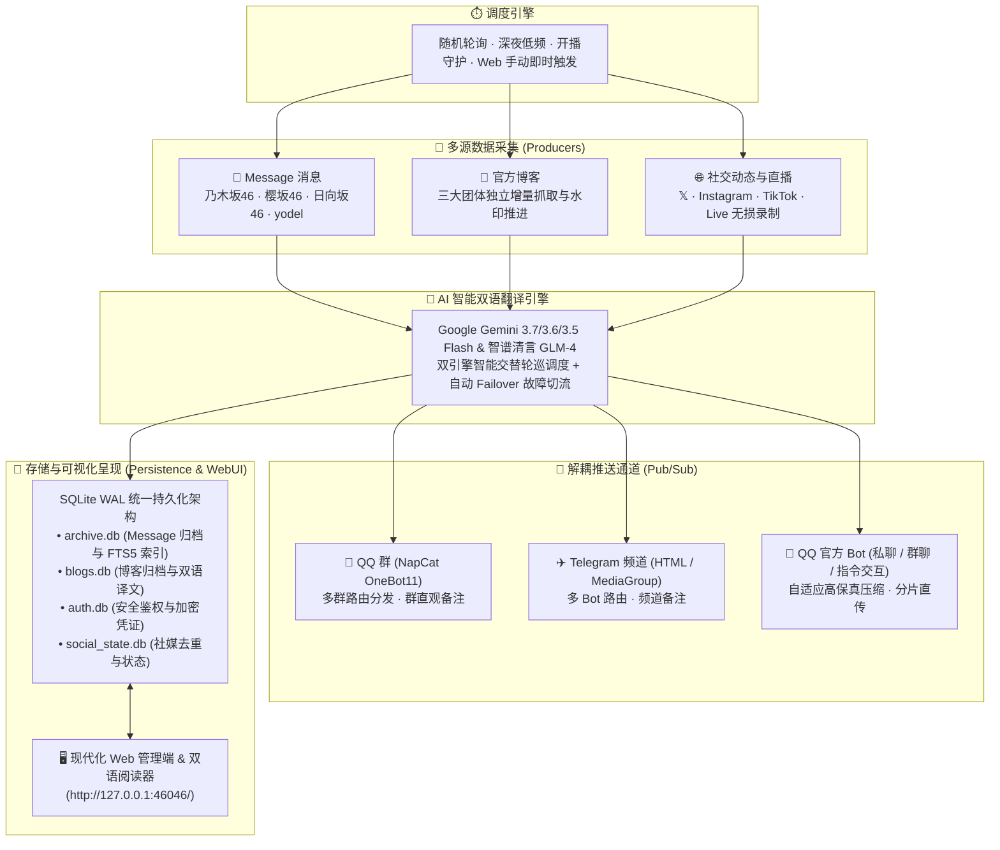
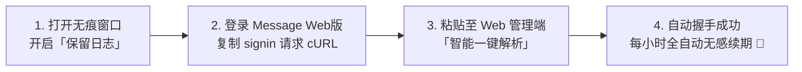
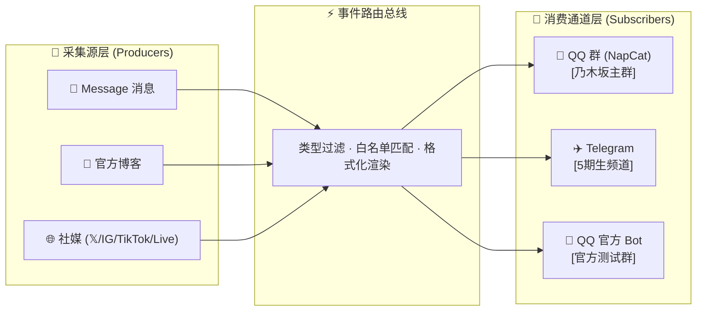

<div align="center">


# Sakamichi Message Push (坂道消息推送与归档系统)

> **乃木坂46 / 櫻坂46 / 日向坂46 / yodel Message 私密消息 · 官方博客 · 社交媒体（𝕏 / Instagram / TikTok / Live 直播录制）全自动智能监控、Google Gemini & 智谱清言 AI 多引擎双语翻译、多通道格式化广播与本地永久持久化归档系统。**

[](https://www.python.org/)
[](LICENSE)
[]()
[]()
[](https://github.com/astral-sh/ruff)
[](tests/)

[🚀 快速开始](#-快速开始--quick-start) • [✨ 核心特性](#-核心特性--features) • [🧩 系统架构](#-系统核心架构--architecture) • [🖥️ WebUI 指南](#️-web-管理端与日常运维) • [🛠️ 运维与工具](#️-命令行辅助工具与进阶配置) • [❓ 常见问题](#-常见故障排查--faq)

</div>

---

## 💡 为什么选择本项目？

- 🔄 **全平台聚合监控**：支持乃木坂46、櫻坂46、日向坂46及 yodel（毕业成员/官方）Message 消息、官方博客、𝕏 (Twitter)、Instagram (Feed/Story/Reels)、TikTok 视频及 **TikTok Live 直播开播秒级探测与 ffmpeg 无损录制**；
- 🤖 **AI 双引擎智能翻译**：Google Gemini 与 智谱清言（GLM-4-Flash 永久免费且国内免翻直连）**智能轮流调度与自动容灾**，呈现偶像口吻的地道中文；
- 📢 **全通道解耦分发**：支持 **QQ 群（NapCat OneBot11）**、**Telegram 频道（HTML 富文本）** 及 **QQ 官方开放平台机器人（个人/群聊/交互指令）**，支持独立备注与精细过滤；
- 💾 **本地永久归档与全文检索**：全量多媒体（原图/语音/视频/粉丝信件）本地落盘；内置 **SQLite WAL + FTS5 全文索引** 与 **Gemini Vision 图片智能打标**；
- 📱 **现代化响应式 Web 门户**：三坂便当卡大盘、时光隧道、三态双语博客阅读器、Message 时间线画廊，移动端原生 Action Sheet 深度适配，**全过程界面点选，无需修改任何代码或配置**。



---

## 📑 目录

- [Sakamichi Message Push (坂道消息推送与归档系统)](#sakamichi-message-push-坂道消息推送与归档系统)
  - [💡 为什么选择本项目？](#-为什么选择本项目)
  - [📑 目录](#-目录)
  - [🚀 快速开始 / Quick Start](#-快速开始--quick-start)
    - [方式 A：Docker Compose 部署 (强烈推荐)](#方式-adocker-compose-部署-强烈推荐)
    - [方式 B：原生 Python 环境运行](#方式-b原生-python-环境运行)
    - [🖥️ 首次登录与 Web 界面极简配置 (4 步搞定)](#️-首次登录与-web-界面极简配置-4-步搞定)
    - [🔑 Message 账号凭证极简提取指南 (Web 一键复制，1 分钟搞定)](#-message-账号凭证极简提取指南-web-一键复制1-分钟搞定)
    - [🔑 初始管理员账号与密码重置](#-初始管理员账号与密码重置)
  - [✨ 核心特性 / Features](#-核心特性--features)
    - [1. Message 私密消息、yodel 与粉丝信件归档](#1-message-私密消息yodel-与粉丝信件归档)
    - [2. 官方博客智能解析与双语阅读器](#2-官方博客智能解析与双语阅读器)
    - [3. 全平台社交媒体监控与直播录制](#3-全平台社交媒体监控与直播录制)
    - [4. AI 双引擎翻译与全渠道格式化排版](#4-ai-双引擎翻译与全渠道格式化排版)
    - [5. 安全架构与双角色权限体系](#5-安全架构与双角色权限体系)
  - [🧩 系统核心架构 / Architecture](#-系统核心架构--architecture)
    - [1. Pub/Sub 订阅分发模型与渠道备注](#1-pubsub-订阅分发模型与渠道备注)
    - [2. 单次鉴权下载流水线 (Single-Download Flow)](#2-单次鉴权下载流水线-single-download-flow)
    - [3. 凭证全自动握手续期机制 (Web vs Mobile)](#3-凭证全自动握手续期机制-web-vs-mobile)
  - [🖥️ Web 管理端与日常运维](#️-web-管理端与日常运维)
    - [1. 七大管理页签一览](#1-七大管理页签一览)
    - [2. QQ 官方机器人私聊指令矩阵](#2-qq-官方机器人私聊指令矩阵)
  - [🛠️ 命令行辅助工具与进阶配置](#️-命令行辅助工具与进阶配置)
    - [1. `tools/` 运维管理工具矩阵](#1-tools-运维管理工具矩阵)
    - [2. 服务化后台守护 (Windows / Linux)](#2-服务化后台守护-windows--linux)
    - [3. 进阶底层配置结构参考](#3-进阶底层配置结构参考)
  - [❓ 常见故障排查 / FAQ](#-常见故障排查--faq)
  - [📄 开源协议与免责声明 / License](#-开源协议与免责声明--license)

---

## 🚀 快速开始 / Quick Start

### 方式 A：Docker Compose 部署 (强烈推荐)

适用于群晖 Synology、QNAP、Unraid、1Panel、Portainer、云服务器及本地 Docker 环境。

1. **新建目录并创建 `docker-compose.yml`**：
   ```yaml
   services:
     sakamichi-push:
       image: ghcr.io/tomisatonao/nogizaka-message-push:latest
       container_name: sakamichi-push
       restart: unless-stopped
       ports:
         - "127.0.0.1:46046:46046"
       environment:
         - TZ=Asia/Tokyo
       volumes:
         - ./config:/app/config
         - ./data:/app/data
         - ./logs:/app/logs
         - ./.env:/app/.env
   ```

2. **一键拉起服务**：
   ```bash
   docker compose up -d
   ```

3. **查看初始密码**：
   ```bash
   docker logs sakamichi-push
   ```
   在服务器本机打开浏览器访问 **`http://127.0.0.1:46046/`** 登录。需要远程访问时，请通过 HTTPS 反向代理公开该地址，并配置 `web_admin.origin` 与 `auth.cookie_secure`。

---

### 方式 B：原生 Python 环境运行

需要 **Python 3.10+** 及 `ffmpeg`（音视频处理）。

1. **克隆代码与安装依赖**：
   ```bash
   git clone https://github.com/TomisatoNao/nogizaka-message-push.git
   cd nogizaka-message-push

   pip install -r requirements.txt
   ```

2. **启动主程序**：
   ```bash
   python main.py
   ```
   控制台将高亮输出初始账号及密码：
   ```text
   ======================================================================
   🔑 系统首次运行：已为您自动创建初始管理员账号！
      • 用户名:   admin
      • 初始密码: 7Kq9vWx2mP4z
      • Web 管理端: http://127.0.0.1:46046/
   ======================================================================
   ```

3. **打开浏览器**：访问 **`http://127.0.0.1:46046/`** 即可直接登录。

---

### 🖥️ 首次登录与 Web 界面极简配置 (4 步搞定)

> [!TIP]
> **全流程图形化配置**：登录后台后，所有设置均可直接在网页端点选完成，**无需手动打开或编辑任何配置文件**！

1. **配置 AI 翻译**：进入「⚙️ 系统设置」，录入 Google Gemini API Key（[免费获取](https://aistudio.google.com/apikey)）或智谱开放平台 API Key（[免费获取](https://open.bigmodel.cn/)，国内免翻直连）；
2. **开启推送渠道**：进入「📢 推送通道」，开启 Telegram 频道、NapCat QQ 群 或 QQ 官方机器人，设置「备注名」（如 `乃木坂主群`），并点击「📨 发送测试」验证连通性；
3. **添加账号与监控成员**：进入「👥 账号与成员」，点击「填凭证」直接粘贴 Message 抓包 cURL，然后点击「📋 从账号拉取成员列表」一键勾选要监控的成员；
4. **即时生效**：点击右上角「⟳ 重新载入」，系统即刻进入全自动抓取、翻译、推送与持久化归档状态！

---

### 🔑 Message 账号凭证极简提取指南 (Web 一键复制，1 分钟搞定)

> [!TIP]
> **无需任何抓包软件**：无需安装 Fiddler、Charles、Mitmproxy 等抓包工具，直接在电脑浏览器（Chrome / Edge 等）利用自带的开发者工具（F12）即可 **1 分钟内完成全套凭证复制**，系统支持 cURL 智能一键解析！



#### 步骤 1：打开浏览器无痕窗口并开启「保留日志」
1. 建议在浏览器中打开 **无痕模式（Incognito Window）**，避免历史登录缓存干扰；
2. 访问对应团体的 Message Web 版官方欢迎页：
   - **乃木坂46 Message**: `https://message.nogizaka46.com/welcome`
   - **櫻坂46 Message**: `https://message.sakurazaka46.com/welcome`
   - **日向坂46 Message**: `https://message.hinatazaka46.com/welcome`
3. 按键盘 **`F12`**（或鼠标右键选择「检查」）打开开发者工具，切换到 **「网络 (Network)」** 标签页；
4. 🔴 **关键要点**：务必勾选顶部的 **「保留日志 (Preserve log)」** 复选框（防止页面授权跳转重定向时清空抓包记录）。

#### 步骤 2：登录账号并复制 `signin` 请求 cURL
1. 在网页上勾选服务条款与隐私政策，点击「开始」并完成你的第三方账号（Google / Apple / Sony 等）授权登录；
2. 登录成功跳转后，在右侧 F12「网络」请求列表中找到名为 **`signin`** 的请求（或任意包含鉴权凭证的请求如 `profile` / `timeline`）；
3. **右键点击 `signin` 请求** ➔ **「复制 (Copy)」** ➔ 选择 **「以 cURL (bash) 格式复制」** 或 **「以 cURL (cmd) 格式复制」**（也可以选择「复制请求标头」）。

#### 步骤 3：粘贴至 Web 管理端，一键解析并自动握手
1. 打开本系统 Web 管理后台（`http://127.0.0.1:46046/`）➔ 进入 **「👥 账号与成员」** 页面；
2. 找到对应团体账号，点击 **「🔑 填写凭证」** 按钮；
3. 点击展开 **「📋 智能一键解析」**，直接将刚才复制的整段 cURL 代码粘贴到文本框中，点击 **「🚀 解析并填充」**；
4. 系统将瞬间自动提取并填入 `access_token`、`refresh_token`、`session` Cookie 及 `user_id` 等全部参数；
5. 点击 **「🔐 保存并自动握手」**，系统将自动发起鉴权握手，并在后台开启**每小时全自动无感静默续期**，永不过期！

---

### 🔑 初始管理员账号与密码重置

若未留意或遗忘了密码，可在终端直接重设：

```bash
# 方式 1：直接修改/重设 admin 密码（需 ≥ 8 位）
python tools/manage_users.py passwd admin YourNewPassword123

# 方式 2：交互式重置用户库并重新生成随机密码
python tools/manage_users.py reset
```

---

## ✨ 核心特性 / Features

### 1. Message 私密消息、yodel 与粉丝信件归档
- **四团 Message 原生解析**：支持乃木坂46、櫻坂46、日向坂46及 yodel 平台的多媒体消息（文本、原图、音频语音、高清视频）；
- **粉丝信件 (Fan Letters) 归档**：从 CloudFront 私有 CDN 完整保存你发给成员的高清信纸长图原图、正文、发送时间与收藏标记；
- **极速冷启动与全文搜索**：基于 SQLite WAL 模式与 FTS5 引擎，万级历史记录毫秒级中日双语搜索，Gzip 极速传输，冷启动就绪时间 **<1 秒**；
- **Gemini Vision 智能打标**：自动对消息图片进行 10 种类目（自拍/合照/舞台/外出/美食等）语义打标。

### 2. 官方博客智能解析与双语阅读器
- **DOM 分段合并与大段落还原**：兼容三团官网差异化 DOM，保留段内留白与换行，还原官方博客视效节奏；
- **图片节点原位保护**：翻译前抽离并标记正文 ``，翻译完成后无损插回原位，杜绝漏图、跳段与长文截断；
- **三态语言视图自由切换**：双语阅读器支持「日中对照（日文斜体 + 中文常规体）」、「仅日文」及「仅中文」；
- **四维黄金排序**：作者列表与消息列表严格按「乃木坂 → 櫻坂 → 日向坂 → yodel → 1..6期 → 五十音」统一规范分层排列。

### 3. 全平台社交媒体监控与直播录制
- **多平台免登录抓取**：
  - **𝕏 (Twitter)**：三级降级容灾，自动提取原图无损直链（`?name=orig`）与无障碍 Alt 文本并翻译；
  - **Instagram**：支持 Feed 轮播多图、Reels 短视频及 24h 快拍（Story），内置安全频控限流熔断；
  - **TikTok**：短视频、图文幻灯片及原声音频无水印提取；
- **TikTok Live 直播开播守护**：8 秒超轻量探测（单次约 120 字节），开播瞬间毫秒级捕获 HLS/FLV 流并拉起 ffmpeg 无损切片录制，优雅停机保护 Moov Atom；
- **成员与账号解耦**：支持监控未开通 Message 的毕业成员、其他偶像团体（=LOVE / 48系等）的纯社媒与博客动态。

### 4. AI 双引擎翻译与全渠道格式化排版
- **Gemini + 智谱清言 双引擎轮流调度**：支持两家大模型均匀交替轮询（Round-Robin），并在遇到额度超限或网络故障时秒级自动容灾切换；
- **zakablog 博客排版规范**：全渠道推送统一样式（Header 信息头 + AI 翻译模型溯源徽章 + 双语对照正文 + 多图/长图卡片）；
- **Message 居中徽章排版**：日文原文与中文译文之间嵌入 `─── 🌐 译文 (模型名) ───` 来源徽章。

### 5. 安全架构与双角色权限体系
- **RBAC 双角色模型**：`admin` 拥有完整管理权限；`viewer` 仅可查阅归档与阅读器；支持一键开启 `auth.archive_public` 供同好免登录公开查阅归档；
- **密码哈希与防锁死保护**：`scrypt` 强加盐哈希，`hmac.compare_digest` 常时比对，IP 连续输错临时锁定，系统严格禁止删除最后一个管理员账号。

---

## 🧩 系统核心架构 / Architecture

### 1. Pub/Sub 订阅分发模型与渠道备注



- **全渠道备注支持**：每个群、每个 Bot 均支持直观备注（如 `乃木坂主群`、`5期生频道`），管理端与弹窗清晰展示；
- **独立过滤与订阅开关**：各通道可独立勾选接收的内容类型，并设置 `member_filter`、`blog_filter`、`social_filter`。

### 2. 单次鉴权下载流水线 (Single-Download Flow)

针对坂道 Message 托管在 CloudFront 上的私有鉴权媒体，系统采用单次流水线架构：

```
收到新消息
   ↓
1. AI 双引擎轮巡翻译
   ↓
2. 【归档模块】携带账号凭证 Headers 从 CloudFront 统一鉴权下载至本地磁盘（仅 1 次网络请求）
   ↓
3. 【推送模块】各推送通道直接读取本地磁盘文件字节秒级上传分发（0 次额外网络请求）
   ↓
4. 上传至各通道，完成推送
```

### 3. 凭证全自动握手续期机制 (Web vs Mobile)

系统全面支持 **Web（网页端会话）** 与 **Mobile（移动端 OAuth）** 双模式：

```
浏览器 F12 复制 signin cURL
   ↓
Web 管理端「智能一键解析」➔ 自动提取 access_token / refresh_token / session Cookie
   ↓
安全写入 SQLite (data/auth.db)
   ↓
每次巡查前校验 JWT 剩余寿命 (exp)
   ├─ 剩余 > 300s ─── 直接使用现有 Token 请求 Message
   └─ 剩余 ≤ 300s ─── 后台自动带 session Cookie 握手续期，0 秒无感刷新
```

- **0 秒全套凭证捕获**：在浏览器开发者工具中，复制登录时 `signin` 请求的 cURL 并在 WebUI 粘贴，系统自动解构出 Token、User ID 与持久会话 Cookie；
- **全自动无感续期**：每次巡查前严格校验 JWT `exp` 寿命，当 Token 剩余有效期不足 300 秒时，后台自动静默发起握手续期，实现永久有效、永不掉线。

---

## 🖥️ Web 管理端与日常运维

管理端监听于 **`http://127.0.0.1:46046/`**。

### 1. 七大管理页签一览

| 页签 | 功能概要与亮点 |
|---|---|
| **📊 状态** | 实时巡查轮次、下次倒计时、各账号 Token 剩余寿命、通道健康度、立即巡查与测试推送。 |
| **👥 账号与成员** | 账号凭证在线填报与握手测试；**成员订阅状态胶囊（🌟已订阅·至9/1、⏳曾订阅、⚫离线）**；未订阅成员智能跳过轮询抓取。 |
| **📢 推送通道** | NapCat QQ、Telegram、QQ 官方 Bot 开关、API 配置、**渠道备注名**、订阅开关与白名单过滤。 |
| **🌐 动态监控** | 官方博客（三团独立开关/频率）、𝕏 (Twitter)、Instagram (Feed/Story)、TikTok 短视频与 TikTok Live 直播录制总控。 |
| **⚙️ 系统设置** | Message 轮询时段（日间/深夜/休眠）、AI 翻译多引擎参数与 API Key、本地归档、每日健康报告。 |
| **🔑 用户** | scrypt 加盐哈希用户鉴权、在线增删用户、分配角色、随机高强度密码生成。 |
| **🛠️ 高级** | 实时脱敏运行日志控制台、全局 JSON 配置可视化在线编辑及 **10 份历史配置快照一键回滚**。 |

### 2. QQ 官方机器人私聊指令矩阵

启用 QQ 官方 Bot 并在后台开启「指令监听」后，授权管理员私聊机器人即可直接发送交互指令（走被动回复通道，不消耗主动推送额度）：

| 指令 | 说明 | 示例 |
|---|---|---|
| `/help` | 查看支持的完整指令菜单 | `/help` |
| `/status` | 实时查看系统运行时间、巡查轮次与账号状态 | `/status` |
| `/members` | 查看当前监控的所有成员与绑定通道 | `/members` |
| `/latest [成员名] [条数]` | 调取指定成员最新的 Message 消息 | `/latest 冨里奈央 3` |
| `/search <关键词>` | 全归档双语全文检索最近 5 条匹配记录 | `/search ミーグリ` |
| `/stats` | 统计各成员历史归档总量与月份跨度 | `/stats` |

---

## 🛠️ 命令行辅助工具与进阶配置

> [!NOTE]
> 系统日常运行所需的全部配置与凭证更新均可在 Web 管理端完成。以下工具主要面向服务器自动化运维、数据补全与离线分析场景。

### 1. `tools/` 运维管理工具矩阵

| 工具脚本 | 运行命令 | 核心功能 |
|---|---|---|
| `manage_users.py` | `python tools/manage_users.py passwd admin` | 命令行增删用户、重置密码、角色调整与系统初始化 |
| `archive_letters.py` | `python tools/archive_letters.py [成员名]` | 归档粉丝信件（Fan Letters）高清信纸原图入库 |
| `backfill_archive.py` | `python tools/backfill_archive.py 冨里奈央 --from 2023-01-01` | 回填指定成员的历史 Message 消息与媒体 |
| `archive_member.py` | `python tools/archive_member.py <博客URL> --translate` | 归档全量历史博客、下载原图并进行 AI 补翻 |
| `sync_archive_db.py` | `python tools/sync_archive_db.py` | 扫描本地磁盘归档并全量重构 SQLite 数据库与 FTS5 索引 |
| `tag_images.py` | `python tools/tag_images.py --member 冨里奈央` | 批量对历史归档图片调用 Gemini Vision 补全标签 |
| `get_qq_openid.py` | `python tools/get_qq_openid.py [APP_ID] [SECRET]` | 快速捕获 QQ 官方 Bot 私聊用户的 `target_openid` |
| `get_qq_group_openid.py` | `python tools/get_qq_group_openid.py [APP_ID] [SECRET]` | 快速捕获 QQ 官方 Bot 所在群的 `group_openid` |

### 2. 服务化后台守护 (Windows / Linux)

<details>
<summary><b>Windows 计划任务后台守护（防多开孤儿进程，点击展开）</b></summary>

```powershell
# 以管理员权限打开 PowerShell 执行：
powershell -ExecutionPolicy Bypass -File tools\install_autostart.ps1 -Start     # 安装自启并立即运行
powershell -ExecutionPolicy Bypass -File tools\install_autostart.ps1 -Status    # 查看运行状态
powershell -ExecutionPolicy Bypass -File tools\install_autostart.ps1 -Stop      # 优雅停机
powershell -ExecutionPolicy Bypass -File tools\install_autostart.ps1 -Uninstall # 卸载任务
```
</details>

<details>
<summary><b>Linux Systemd 守护服务（点击展开）</b></summary>

```bash
# 用户级服务化（无需 root，自动开启 linger 开机拉起）
bash tools/install_systemd.sh
bash tools/install_systemd.sh --status
bash tools/install_systemd.sh --logs       # 查看实时日志
bash tools/install_systemd.sh --stop       # 停止服务
```
</details>

### 3. 审计、备份与健康监控

- Web 管理端的登录、注销、用户管理、归档自定义标签、配置/密钥变更，以及重启/立即巡查会写入 `logs/audit.jsonl`；在「📟 控制台实时运行日志」中切换到「管理审计日志」即可查看。审计记录会自动脱敏，并按大小滚动保留。
- 备份默认包含 `config/` 与 `data/`，**可能含凭据数据库**；备份文件请保存在受限位置，不要上传至公开仓库。

```bash
# 创建备份，默认保留最近 7 份
python tools/backup_data.py create

# 校验备份完整性（不写入数据）
python tools/backup_data.py verify backups/sakamichi-backup-YYYYMMDD-HHMMSS.tar.gz

# 仅预演恢复；确认已停止服务后才执行下一条
python tools/backup_data.py restore backups/sakamichi-backup-YYYYMMDD-HHMMSS.tar.gz
python tools/backup_data.py restore backups/sakamichi-backup-YYYYMMDD-HHMMSS.tar.gz --apply
```

- 使用 Uptime Kuma 等工具监控 `https://<你的域名>/api/health/status`。项目已有的 QQ/TG/官方 Bot 告警通道会沿用各通道的 `push_alert` 配置发送运行告警。

### 4. 进阶底层配置结构参考

<details>
<summary><b>底层配置文件结构参考（仅供自动化脚本与开发者查阅，点击展开）</b></summary>

Web 管理端保存的配置会自动持久化至 `config/config.json` 与 `.env` 文件。其核心结构如下：

#### `config/config.json` 结构示例
```jsonc
{
  "channels": { "napcat": true, "tg": false, "qq_official": false },
  "napcat_api": "http://127.0.0.1:3000/send_group_msg",
  "napcat_routes": [
    {
      "group_id": 533072575,
      "remark": "乃木坂主群",
      "push_message": true,
      "push_blog": true,
      "member_filter": ["冨里 奈央"],
      "blog_filter": ["nogizaka"]
    }
  ],
  "web_admin": { "enabled": true, "host": "0.0.0.0", "port": 46046 },
  "archive": { "enabled": true, "dir": "data/archive", "media": true },
  "translate": true,
  "gemini_models": ["gemini-3.7-flash", "glm-4-flash"],
  "day_interval": [120, 180],
  "night_interval": [1500, 1800],
  "sleep_hours": [2, 7]
}
```

> Docker Compose 默认只将管理端发布到宿主机 `127.0.0.1:46046`。需要远程访问时，请使用 HTTPS 反向代理，并在 `web_admin.origin` 填写外部地址、在 `auth.cookie_secure` 设为 `true`；不要直接将 HTTP 管理端暴露到公网。

#### `.env` 环境变量列表
```bash
GEMINI_API_KEY=AIzaSy...               # Google Gemini API Key
ZHIPU_API_KEY=df488cc9...              # 智谱开放平台 API Key
TG_BOT_TOKEN=123456:ABC...             # Telegram Bot Token
WEB_ADMIN_TOKEN=your_token             # Web 管理端外部 API 调用 Token (可选)
INSTAGRAM_SESSIONID=123456789%3Axxx    # Instagram 24h 快拍凭证 (可选)
```

</details>

---

## ❓ 常见故障排查 / FAQ

<details>
<summary><b>Q1: 首次启动没看清 admin 密码怎么办？</b></summary>

在项目根目录下执行 `python tools/manage_users.py passwd admin <你的新密码>` 即可直接重设；或者执行 `python tools/manage_users.py reset` 重新生成初始随机密码。
</details>

<details>
<summary><b>Q2: 提示「没有任何可用推送目标」？</b></summary>

进入 Web 管理端「📢 推送通道」，开启对应的通道（如 NapCat / Telegram / QQ 官方 Bot），并在路由规则中确保该通道已勾选对应的消息类型，且 `member_filter` / `blog_filter` 未将目标内容过滤掉。
</details>

<details>
<summary><b>Q3: Telegram 推送报错 Chat not found？</b></summary>

请确保你创建的 Telegram Bot 已被拉入目标频道，并已被赋予「Post Messages（发布消息）」管理员权限。频道 ID 通常为 `-100` 开头的数字，可使用 `@getidsbot` 获取。
</details>

<details>
<summary><b>Q4: QQ 官方 Bot 报错 40093011 (上传文件大小超过限制)？</b></summary>

本项目已集成 PIL 自适应高保真压缩与分片直传技术，自动将图片限制在 2.5MB 内、视频走 COS 分片直传。请确保使用的代码为最新版本。
</details>

<details>
<summary><b>Q5: 为什么有原文但没有中文翻译？</b></summary>

请进入 Web 管理端「⚙️ 系统设置」，检查是否已录入 `GEMINI_API_KEY` 或 `ZHIPU_API_KEY`。推荐同时录入两者，系统将自动开启双活轮询与故障容灾。
</details>

<details>
<summary><b>Q6: 如何将 Message 归档免登录公开给同好浏览？</b></summary>

在 Web 管理端「⚙️ 系统设置」中开启 `auth.archive_public: true` 并保存，此时管理后台仍然受密码保护，而 `/archive` 页面允许所有人匿名查阅。
</details>

<details>
<summary><b>Q7: 复制了 cURL 粘贴后提示「未包含有效凭证」或找不到 signin 请求？</b></summary>

1. **务必勾选「保留日志 (Preserve log)」**：第三方账号（Google/Apple/Sony）登录过程伴随多次 302 重定向，若未勾选保留日志，关键的 `signin` 请求会在页面跳转时被浏览器 DevTools 自动清空；
2. **推荐使用无痕窗口 (Incognito)**：若浏览器已有持久缓存，直接访问可能会跳过 `signin` 授权请求。打开无痕窗口重新从 `/welcome` 页面点击登录即可完整捕获；
3. **支持多种请求格式**：除了 `signin` 请求外，右键复制 `timeline` 或 `profile` 请求的 cURL，系统同样支持智能解析提取。
</details>

---

## 📄 开源协议与免责声明 / License

本项目采用 [MIT License](LICENSE) 许可证开源。

> [!IMPORTANT]
> **免责声明**：本项目仅供粉丝个人技术研究、学习交流与偶像应援使用。所涉及的偶像消息、官方博客及媒体资源版权均归各运营方（乃木坂46合同会社、Seed & Flower合同会社等）及原作者所有。请勿将本项目用于任何商业营利用途，使用本项目所产生的一切后果由使用者自行承担。
