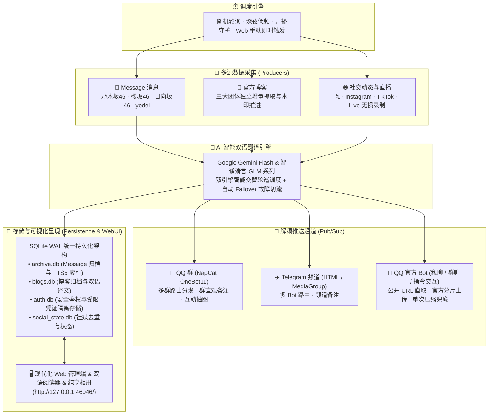
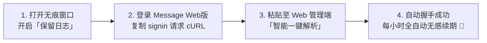
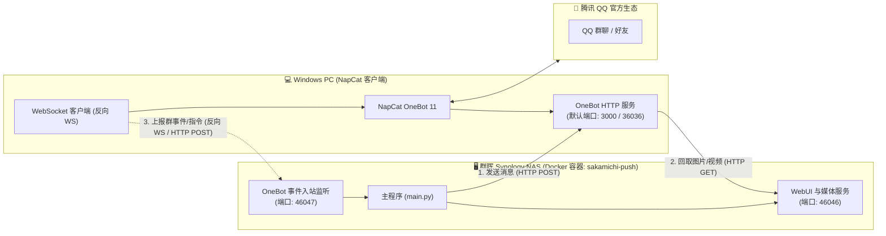

<div align="center">


# Sakamichi Message Push (坂道消息推送与归档系统)

> **乃木坂46 / 櫻坂46 / 日向坂46 / yodel Message 私密消息 · 官方博客 · 社交媒体（𝕏 / Instagram / TikTok / Live 直播录制）全自动智能监控、Google Gemini & 智谱清言 AI 多引擎双语翻译、多通道格式化广播、本地永久持久化归档与纯享美图画廊系统。**

[](https://www.python.org/)
[](LICENSE)
[]()
[]()
[](https://github.com/astral-sh/ruff)
[](tests/)

[🚀 快速开始](#-快速开始--quick-start) • [🌐 部署与网络拓扑](#-网络拓扑与协同部署-nas--windows-napcat) • [✨ 核心特性](#-核心特性--features) • [🖼️ 相册画廊与互动抽图](#-相册画廊与-qq-群本地互动抽图) • [🖥️ WebUI 门户](#️-web-管理端与日常运维) • [🤖 机器人指令](#-机器人指令矩阵) • [🛠️ 运维与工具](#️-命令行辅助工具与进阶配置) • [❓ 常见问题](#-常见故障排查--faq)

</div>

---

## 💡 为什么选择本项目？

- 🔄 **全平台聚合监控**：支持乃木坂46、櫻坂46、日向坂46及 yodel（毕业成员/官方）Message 消息、官方博客、𝕏 (Twitter)、Instagram (Feed/Story/Reels)、TikTok 视频及 **TikTok Live 直播开播秒级探测与 ffmpeg 无损录制**；
- 🤖 **AI 双引擎智能翻译**：Google Gemini 与智谱清言（GLM 系列）**智能轮流调度与自动容灾**，呈现偶像口吻的地道中文；
- 📢 **全通道解耦分发**：支持 **QQ 群（NapCat OneBot11）**、**Telegram 频道（HTML 富文本）** 及 **QQ 官方开放平台机器人（个人/群聊/交互指令）**，支持独立备注与精细过滤；QQ 官方 Bot 媒体支持公开 URL 直取与官方分片上传；
- 🎲 **QQ 群本地互动抽图 & AI 拟人化闲聊**：内置零 Token 消耗的 `/抽张美图` 加权公平抽图指令（毫秒响应、多层防刷、严格过滤与零 SQL 注入），并支持基于大模型的偶像拟人自然语言群聊交互；
- 🖼️ **纯享美图画廊 (Gallery)**：汇聚 Message 私密照片与官方博客配图，支持全量成员名册与作者多维检索、年份时间轴筛选、瀑布流无限滚动与 WebP 缩略图极速秒开（压缩率 99.4%）；
- 🔁 **失败目标精准补偿**：成员消息与社交动态按“内容 × 推送目标”记录投递状态；已成功的目标不会重复发送，失败目标会在后续巡查中自动补偿；
- 💾 **本地永久归档与全文检索**：全量多媒体（原图/语音/视频/粉丝信件）本地落盘；内置 **SQLite WAL + FTS5 全文索引** 与 **Gemini Vision 图片智能打标**；
- 📱 **现代化响应式 Web 门户**：三坂便当卡大盘、时光隧道、三态双语博客阅读器、Message 时间线画廊，移动端原生 Action Sheet 深度适配，绝大部分监控项、通道路由与账号凭证均支持 Web 界面可视化管理。



---

## 📑 目录

- [Sakamichi Message Push (坂道消息推送与归档系统)](#sakamichi-message-push-坂道消息推送与归档系统)
  - [💡 为什么选择本项目？](#-为什么选择本项目)
  - [📑 目录](#-目录)
  - [🚀 快速开始 / Quick Start](#-快速开始--quick-start)
    - [方式 A：Docker Compose 部署 (强烈推荐)](#方式-adocker-compose-部署-强烈推荐)
    - [方式 B：原生 Python 环境运行](#方式-b原生-python-环境运行)
    - [🖥️ 首次登录与 Web 界面极简配置 (4 步搞定)](#️-首次登录与-web-界面极简配置-4-步搞定)
    - [🔑 Message 账号凭证极简提取指南 (Web 一键复制，1 分钟搞定)](#-message-账号凭证极简提取指南-web-一键复制1-分钟搞定)
    - [🔑 初始管理员账号与密码重置](#-初始管理员账号与密码重置)
  - [🌐 网络拓扑与协同部署 (NAS + Windows NapCat)](#-网络拓扑与协同部署-nas--windows-napcat)
    - [1. 常见协同部署架构拓扑](#1-常见协同部署架构拓扑)
    - [2. NapCat 主动推送与媒体回取配置](#2-napcat-主动推送与媒体回取配置)
    - [3. NapCat 入站事件监听 (群指令 / 社媒链接 / AI闲聊)](#3-napcat-入站事件监听-群指令--社媒链接--ai闲聊)
  - [✨ 核心特性 / Features](#-核心特性--features)
    - [1. Message 私密消息、yodel 与粉丝信件归档](#1-message-私密消息yodel-与粉丝信件归档)
    - [2. 官方博客智能解析与双语阅读器](#2-官方博客智能解析与双语阅读器)
    - [3. 全平台社交媒体监控与直播录制](#3-全平台社交媒体监控与直播录制)
    - [4. AI 双引擎翻译与全渠道格式化排版](#4-ai-双引擎翻译与全渠道格式化排版)
    - [5. 安全架构与权限体系](#5-安全架构与权限体系)
  - [🖼️ 相册画廊与 QQ 群本地互动抽图](#-相册画廊与-qq-群本地互动抽图)
    - [1. Web 纯享相册画廊 (Gallery)](#1-web-纯享相册画廊-gallery)
    - [2. NapCat QQ 群本地互动抽图指令](#2-napcat-qq-群本地互动抽图指令)
    - [3. NapCat 偶像拟人化群聊对话](#3-napcat-偶像拟人化群聊对话)
  - [🖥️ Web 管理端与日常运维](#️-web-管理端与日常运维)
    - [七大管理页签一览](#七大管理页签一览)
  - [🤖 机器人指令矩阵](#-机器人指令矩阵)
    - [1. QQ 群 NapCat 本地指令](#1-qq-群-napcat-本地指令)
    - [2. QQ 官方机器人指令 (私聊 / 群聊 @Bot)](#2-qq-官方机器人指令-私聊--群聊-bot)
  - [🛠️ 命令行辅助工具与进阶配置](#️-命令行辅助工具与进阶配置)
    - [1. `tools/` 运维管理工具矩阵](#1-tools-运维管理工具矩阵)
    - [2. 服务化后台守护 (Windows / Linux)](#2-服务化后台守护-windows--linux)
    - [3. 进阶底层配置结构参考](#3-进阶底层配置结构参考)
  - [❓ 常见故障排查 / FAQ](#-常见故障排查--faq)
  - [📄 开源协议与免责声明 / License](#-开源协议与免责声明--license)

---

## 🚀 快速开始 / Quick Start

### 方式 A：Docker Compose 部署 (强烈推荐)

适用于群晖 Synology NAS、QNAP、Unraid、1Panel、Portainer、云服务器及本地 Docker 环境。

> [!CAUTION]
> **重要目录挂载避坑提示**：
> 项目中的 `config/` 目录不仅包含 `config.json`，还包含核心 Python 模块（如 `config.py`、`credentials.py`）。
> **切勿在宿主机挂载一个空目录覆盖 `/app/config`**，否则会导致容器内缺失源码模块而报错 `ModuleNotFoundError`。
> **正确方式**：请先使用 `git clone` 完整克隆本项目代码后再启动 Compose；若仅单文件运行，请确保本地 `config/` 包含源码文件，或者仅单独挂载 `config.json` 文件（如 `./config/config.json:/app/config/config.json`）。

1. **克隆代码并准备环境**：
   ```bash
   git clone https://github.com/TomisatoNao/nogizaka-message-push.git
   cd nogizaka-message-push
   ```

2. **检查或创建 `docker-compose.yml`**：
   ```yaml
   services:
     sakamichi-push:
       image: ghcr.io/tomisatonao/nogizaka-message-push:latest
       container_name: sakamichi-push
       restart: unless-stopped
       ports:
         - "46046:46046"  # WebUI 管理端与媒体服务端口
         - "46047:46047"  # 可选：NapCat 入站事件监听端口（反向 WS / HTTP POST）
       environment:
         - TZ=Asia/Tokyo
       volumes:
         - ./config:/app/config
         - ./data:/app/data
         - ./logs:/app/logs
         - ./.env:/app/.env
   ```

3. **一键拉起服务**：
   ```bash
   docker compose up -d
   ```

4. **查看初始管理员账号与密码**：
   ```bash
   docker logs sakamichi-push
   ```
   控制台将输出随机生成的初始管理员密码。在浏览器访问 **`http://<服务器IP>:46046/`** 即可登录。

#### 已有 Docker 部署的升级

升级前先拉取新镜像，再重建容器并检查健康状态：

```bash
docker compose pull
docker compose up -d
docker compose ps
curl -fsS http://127.0.0.1:46046/api/health/status
```

---

### 方式 B：原生 Python 环境运行

需要 **Python 3.10+** 及 `ffmpeg`（音视频处理）。

1. **克隆代码与安装依赖**：
   ```bash
   git clone https://github.com/TomisatoNao/nogizaka-message-push.git
   cd nogizaka-message-push

   pip install -r requirements.txt
   # 公开 Instagram Embed 回退与博客卡片渲染需要 Chromium
   playwright install chromium
   ```

2. **启动主程序**：
   ```bash
   python main.py
   ```
   控制台将高亮输出初始账号及密码：
   ```text
   ======================================================================
   🔑 系统首次运行：已为您自动创建初始管理员账号！
      • 用户名:   admin
      • 初始密码: 7Kq9vWx2mP4z
      • Web 管理端: http://127.0.0.1:46046/
   ======================================================================
   ```

3. **打开浏览器**：访问 **`http://127.0.0.1:46046/`** 即可直接登录。

---

### 🖥️ 首次登录与 Web 界面极简配置 (4 步搞定)

> [!TIP]
> **图形化全流程运维**：登录后台后，所有监控项、翻译密钥、推送路由均可在网页端直接点选配置并热重载，日常使用无需手动编辑 JSON 配置文件！

1. **配置 AI 翻译**：进入「⚙️ 系统设置」，录入 Google Gemini API Key（[免费获取](https://aistudio.google.com/apikey)）或智谱开放平台 API Key（[免费获取](https://open.bigmodel.cn/)，国内免翻直连）；
2. **开启推送渠道**：进入「📢 推送通道」，开启 Telegram 频道、NapCat QQ 群 或 QQ 官方机器人，设置「备注名」（如 `乃木坂主群`），并点击「📨 发送测试」验证连通性；
3. **添加账号与监控成员**：进入「👥 账号与成员」，点击「填凭证」直接粘贴 Message 抓包 cURL，然后点击「📋 从账号拉取成员列表」一键勾选要监控的成员；
4. **即时生效**：点击右上角「⟳ 重新载入」，系统即刻进入全自动抓取、翻译、推送与持久化归档状态！

---

### 🔑 Message 账号凭证极简提取指南 (Web 一键复制，1 分钟搞定)

> [!TIP]
> **无需安装任何抓包软件**：直接在电脑浏览器（Chrome / Edge 等）利用自带的开发者工具（F12）即可 **1 分钟内完成全套凭证复制**，系统支持 cURL 智能一键解析！



#### 步骤 1：打开浏览器无痕窗口并开启「保留日志」
1. 建议在浏览器中打开 **无痕模式（Incognito Window）**，避免历史登录缓存干扰；
2. 访问对应团体的 Message Web 版官方欢迎页：
   - **乃木坂46 Message**: `https://message.nogizaka46.com/welcome`
   - **櫻坂46 Message**: `https://message.sakurazaka46.com/welcome`
   - **日向坂46 Message**: `https://message.hinatazaka46.com/welcome`
3. 按键盘 **`F12`**（或鼠标右键选择「检查」）打开开发者工具，切换到 **「网络 (Network)」** 标签页；
4. 🔴 **关键要点**：务必勾选顶部的 **「保留日志 (Preserve log)」** 复选框（防止页面授权跳转重定向时清空抓包记录）。

#### 步骤 2：登录账号并复制 `signin` 请求 cURL
1. 在网页上勾选服务条款与隐私政策，点击「开始」并完成你的第三方账号（Google / Apple / Sony 等）授权登录；
2. 登录成功跳转后，在右侧 F12「网络」请求列表中找到名为 **`signin`** 的请求；必须使用这条请求，因为登录会话的 `Set-Cookie` 只在该登录响应中完成，`profile` / `timeline` 等后续接口不能替代它；
3. **右键点击 `signin` 请求** ➔ **「复制 (Copy)」** ➔ 选择 **「以 cURL (bash) 格式复制」** 或 **「以 cURL (cmd) 格式复制」**。复制结果必须包含请求 URL 与请求体。

#### 步骤 3：粘贴至 Web 管理端，一键解析并自动握手
1. 打开本系统 Web 管理后台（`http://<IP>:46046/`）➔ 进入 **「👥 账号与成员」** 页面；
2. 找到对应团体账号，点击 **「🔑 填写凭证」** 按钮；
3. 点击展开 **「📋 智能一键解析」**，直接将刚才复制的整段 cURL 代码粘贴到文本框中，点击 **「🚀 解析并填充」**；
4. 系统将瞬间自动提取并填入 `access_token`、`refresh_token`、`session` Cookie 及 `user_id` 等全部参数；
5. 点击 **「🔐 保存并自动握手」**，系统会自动发起鉴权握手；在 session 与 refresh_token 仍有效时，巡查前会按 JWT 剩余寿命自动续期。

---

### 🔑 初始管理员账号与密码重置

若未留意或遗忘了密码，可在终端直接重设：

```bash
# 方式 1：直接修改/重设 admin 密码（需 ≥ 8 位）
python tools/manage_users.py passwd admin YourNewPassword123

# 方式 2：交互式重置用户库并重新生成随机密码
python tools/manage_users.py reset
```

---

## 🌐 网络拓扑与协同部署 (NAS + Windows NapCat)

当主程序部署在 NAS（群晖/Linux Docker）而 NapCat 运行在 Windows PC（或其它主机）时，两端存在清晰的**双向协同网络拓扑**：



### 1. 常见协同部署架构拓扑

| 通信方向 | 协议 / 端口 | 作用与配置项 |
|---|---|---|
| **主程序 ➔ NapCat** | HTTP POST (`:3000` 或 `:36036`) | 主程序主动向 NapCat 发送群消息推送。<br/>配置项：`NAPCAT_API_BASE=http://<Windows-IP>:3000` |
| **NapCat ➔ 主程序 (媒体回取)** | HTTP GET (`:46046`) | NapCat 接收到本地文件链接时，回取媒体字节以发送群聊。<br/>配置项：`NAPCAT_MEDIA_BASE_URL=http://<NAS-IP>:46046` |
| **NapCat ➔ 主程序 (事件入站)** | 反向 WebSocket / HTTP POST (`:46047`) | NapCat 将群消息、抽图指令、社媒链接上报给主程序。<br/>WS 地址：`ws://<NAS-IP>:46047/api/napcat/events` |

### 2. NapCat 主动推送与媒体回取配置

在 NAS 端 `.env` 或 `docker-compose.yml` 环境变量中设置：

```bash
# Windows NapCat 的 OneBot HTTP 地址
NAPCAT_API_BASE=http://192.168.22.20:3000
NAPCAT_API_TOKEN=<NapCat中设置的OneBot_Token>

# 告知 NapCat 从何处回取 NAS 上的图片媒体（必须是 NapCat PC 能访问的 NAS 地址）
NAPCAT_MEDIA_BASE_URL=http://192.168.22.13:46046
```

> [!WARNING]
> 切勿将 `NAPCAT_MEDIA_BASE_URL` 填为 `/app/data/...` 或 `127.0.0.1`，否则远程 Windows NapCat 会因无法读取 NAS 容器路径报错 `ENOENT`。

### 3. NapCat 入站事件监听 (群指令 / 社媒链接 / AI闲聊)

当群友发送 `/抽张美图`、分享 X/Ins/TikTok 链接或 @机器人 聊天时，通过 `46047` 端口接入处理：

1. **主程序开启入站**（在 `config/config.json` 或 Web 端设置）：
   ```json
   "napcat_inbound": {
     "enabled": true,
     "transport": "reverse_ws",
     "listen_host": "0.0.0.0",
     "listen_port": 46047,
     "event_path": "/api/napcat/events",
     "cooldown_seconds": 10
   }
   ```
2. **在 Windows NapCat 控制台中配置反向 WebSocket**：
   - 地址：`ws://192.168.22.13:46047/api/napcat/events`
   - Token：与 `.env` 中 `NAPCAT_EVENT_TOKEN` 一致
   - 消息格式：选择 `Array`

---

## ✨ 核心特性 / Features

### 1. Message 私密消息、yodel 与粉丝信件归档
- **四团 Message 原生解析**：支持乃木坂46、櫻坂46、日向坂46及 yodel 平台的多媒体消息（文本、原图、音频语音、高清视频）；
- **粉丝信件 (Fan Letters) 归档**：从 CloudFront 私有 CDN 完整保存发给成员的高清信纸长图原图、正文、发送时间与收藏标记；
- **秒级就绪与全文检索**：基于 SQLite WAL 模式与 FTS5 引擎，万级历史记录毫秒级中日双语搜索，Gzip 极速传输；
- **Gemini Vision 智能打标**：自动对消息图片进行 10 种类目（自拍/合照/舞台/外出/美食等）语义打标。

### 2. 官方博客智能解析与双语阅读器
- **DOM 分段合并与大段落还原**：兼容三团官网差异化 DOM，保留段内留白与换行，还原官方博客视效节奏；
- **图片节点原位保护**：翻译前抽离并标记正文 ``，翻译完成后无损插回原位，杜绝漏图、跳段与长文截断；
- **三态语言视图自由切换**：双语阅读器支持「日中对照（日文斜体 + 中文常规体）」、「仅日文」及「仅中文」；
- **四维黄金排序**：作者列表与消息列表严格按「乃木坂 → 櫻坂 → 日向坂 → yodel → 1..6期 → 五十音」统一规范分层排列。

### 3. 全平台社交媒体监控与直播录制
- **多平台抓取与登录边界**：
  - **𝕏 (Twitter)**：三级降级容灾，自动提取原图无损直链（`?name=orig`）与无障碍 Alt 文本并翻译；
  - **Instagram**：公开帖子 / Reel / 图片优先使用匿名 Embed 解析；Feed 与 24h 快拍（Story）仍需有效 Cookies，内置安全频控限流熔断；
  - **TikTok**：短视频、图文幻灯片及原声音频无水印提取；
- **TikTok Live 直播开播守护**：8 秒超轻量探测（单次约 120 字节），开播瞬间毫秒级捕获 HLS/FLV 流并拉起 ffmpeg 无损切片录制，优雅停机保护 Moov Atom；
- **成员目录与社媒分层**：Message 监控成员仅从乃木坂46、樱坂46、日向坂46及 yodel 的官方账号目录同步；X / Instagram / TikTok 等其他社媒账号统一在动态监控页面配置。

### 4. AI 双引擎翻译与全渠道格式化排版
- **Gemini + 智谱清言 双引擎轮流调度**：支持两家大模型均匀交替轮询（Round-Robin），并在遇到额度超限或网络故障时秒级自动容灾切换；
- **zakablog 博客排版规范**：全渠道推送统一样式（Header 信息头 + AI 翻译模型溯源徽章 + 双语对照正文 + 多图/长图卡片）；
- **Message 居中徽章排版**：日文原文与中文译文之间嵌入 `─── 🌐 译文 (模型名) ───` 来源徽章。

### 5. 安全架构与权限体系
- **RBAC 双角色模型**：`admin` 拥有完整管理权限；`viewer` 仅可查阅归档与阅读器；支持一键开启 `auth.archive_public` 供同好免登录公开查阅归档；
- **受限凭证隔离存储**：账号凭据保存在本地受限数据库 `data/auth.db` 中隔离管理，用户密码采用 `scrypt` 强加盐哈希，`hmac.compare_digest` 常时比对，IP 连续输错临时锁定，禁止删除最后一个管理员账号。

---

## 🖼️ 相册画廊与 QQ 群本地互动抽图

### 1. Web 纯享相册画廊 (Gallery)

访问 WebUI 顶部的 **「🖼️ 相册」** 标签，即可进入专为坂道偶像打造的高清图片瀑布流画廊：

- **双源自动聚合**：同时汇聚各成员在 Message 私密消息中发送的照片，以及在官方博客中发布的配图；
- **WebP 缩略图极速秒开**：通过后台内置轻量缩略图流水线，将头像与网格图片等比预生成高压缩 WebP（单张仅 4~5 KB，相比动辄 1MB 的原图压缩率达 **99.4%**），数百张图片 50ms 级全量秒开；
- **全屏 Lightbox 原图查看**：点击卡片即刻拉起全屏灯箱，无缝加载 100% 原始无损大图，支持键盘左右键翻页与一键原图下载；
- **年份时间轴智能筛选**：支持按年（如 `2024`、`2025`）快速定位历史美图，无缝搭配逆序与正序浏览。

### 2. NapCat QQ 群本地互动抽图指令

群友在授权的 QQ 群内发送如下指令，即可免消耗 Token 毫秒级抽取偶像美图：

```text
/抽张美图
/抽张美图 冨里奈央
/美图 金川纱耶
/photo 向井纯叶
```

- **加权公平抽选**：根据该小偶像在消息库与博客库中的实际图片数量比例进行加权抽样，彻底解决传统回退机制导致的重复抽图偏差；
- **别名与简繁体互通**：支持常见简繁体汉字（如“纯叶”自动识别为“純葉”、“贺喜”识别为“賀喜”）；
- **三道安全防线，0 SQL 注入风险**：
  1. **严格正则白名单**：输入参数通过 `re.sub(r"[^\w\u4e00-\u9fa5\u3040-\u30ff]", "", arg)` 剥离所有标点符号与特殊字符；
  2. **静态名册枚举比对**：仅在系统已归档目录、官方名册（`sakamichi_roster`）及监控名单中比对，查无此人立即友好阻断；
  3. **100% 参数化预编译查询**：底层 SQLite 交互全部采用 `?` 原生占位符绑定，完全杜绝字符串拼接。
- **频控冷却防刷**：内置单群 4 秒、单用户 8 秒冷却时间，避免高频刷屏。

### 3. NapCat 偶像拟人化群聊对话

开启 `napcat_chat` 模块后，群友在 QQ 群内 `@机器人` 并输入文字，机器人将调用所配置的大模型以偶像拟人口吻自然回复：

```jsonc
"napcat_chat": {
  "enabled": true,
  "model": "gemini-2.5-flash",
  "system_prompt": "你是乃木坂46五期生冨里奈央，性格元气可爱，喜欢用(ˊᵕˋ˶ )等颜文字与粉丝互动...",
  "max_history": 6,
  "cooldown_seconds": 5
}
```

---

## 🖥️ Web 管理端与日常运维

管理端监听于 **`http://<IP>:46046/`**。

### 七大管理页签一览

管理员可见 7 个页签；`viewer` 角色不显示「用户」页签，只能访问消息与博客归档。

| 页签 | 功能概要与亮点 |
|---|---|
| **📊 状态** | 实时巡查轮次、下次倒计时、各账号 Token 剩余寿命、通道健康度、立即巡查与测试推送。 |
| **👥 账号与成员** | 账号凭证在线填报与握手测试；**成员订阅状态胶囊（🌟已订阅·至9/1、⏳曾订阅、⚫离线）**；未订阅成员智能跳过轮询抓取。 |
| **📢 推送通道** | NapCat QQ、Telegram、QQ 官方 Bot 开关、API 配置、**渠道备注名**、订阅开关与白名单过滤。 |
| **🌐 动态监控** | 全局 JST 日间/深夜/休眠时段、Message 与官方博客独立频率、𝕏 (Twitter)、Instagram (Feed/Story)、TikTok 短视频与 TikTok Live 直播录制总控。 |
| **⚙️ 系统设置** | QQ/NapCat 发送节流、告警冷却、单路超时、AI 翻译密钥、网络代理、本地归档与每日健康报告。 |
| **🔑 用户** | scrypt 加盐哈希用户鉴权、在线增删用户、分配角色、随机高强度密码生成、游客公开浏览开关。 |
| **🛠️ 高级** | 实时脱敏运行日志控制台、全局 JSON 配置可视化在线编辑及 **10 份历史配置快照一键回滚**。 |

---

## 🤖 机器人指令矩阵

### 1. QQ 群 NapCat 本地指令

在已加入 NapCat 路由白名单的群聊中直接发送：

| 指令 | 别名 | 参数说明 | 行为描述 |
|---|---|---|---|
| `/抽张美图` | `/抽美图`、`/随机美图`、`/美图`、`/pic`、`/photo` | 可选小偶像名字（如 `冨里奈央`） | 从本地归档与博客库中加权公平抽选一张美图并展示发送日期与正文；未传参数时优先抽选当前群绑定的专属成员。 |

### 2. QQ 官方机器人指令 (私聊 / 群聊 @Bot)

启用 QQ 官方 Bot 并在后台开启「指令监听」后，授权白名单管理员私聊机器人或在群内 @机器人 发送：

| 指令 | 说明 | 示例 |
|---|---|---|
| `/help` | 查看支持的完整官方指令菜单 | `/help` 或 `菜单` |
| `/ping` | 快速测试机器人连接状态与网络延迟 | `/ping` 或 `测试` |
| `/status` | 实时查看系统运行时间、巡查轮次与账号状态 | `/status` 或 `状态` |
| `/members` | 查看当前监控的所有成员与绑定通道 | `/members` 或 `监控` |

---

## 🛠️ 命令行辅助工具与进阶配置

> [!NOTE]
> 系统日常运行所需的全部配置与凭证更新均可在 Web 管理端完成。以下工具主要面向服务器自动化运维、数据补全与离线分析场景。

### 1. `tools/` 运维管理工具矩阵

| 工具脚本 | 运行命令 | 核心功能 |
|---|---|---|
| `manage_users.py` | `python tools/manage_users.py passwd admin` | 命令行增删用户、重置密码、角色调整与系统初始化 |
| `archive_letters.py` | `python tools/archive_letters.py [成员名]` | 归档粉丝信件（Fan Letters）高清信纸原图入库 |
| `backfill_archive.py` | `python tools/backfill_archive.py 冨里奈央 --from 2023-01-01` | 回填指定成员的历史 Message 消息与媒体 |
| `archive_member.py` | `python tools/archive_member.py <博客URL> --translate` | 归档全量历史博客、下载原图并进行 AI 补翻 |
| `backfill_blogs.py` | `python tools/backfill_blogs.py --group nogizaka --download-images` | 按团体顺序批量回填全量历史博客与图片 |
| `sync_archive_db.py` | `python tools/sync_archive_db.py` | 扫描本地磁盘归档并全量重构 SQLite 数据库与 FTS5 索引 |
| `tag_images.py` | `python tools/tag_images.py --member 冨里奈央` | 批量对历史归档图片调用 Gemini Vision 补全标签 |
| `get_qq_openid.py` | `python tools/get_qq_openid.py [APP_ID] [SECRET]` | 快速捕获 QQ 官方 Bot 私聊用户的 `target_openid` |
| `get_qq_group_openid.py` | `python tools/get_qq_group_openid.py [APP_ID] [SECRET]` | 快速捕获 QQ 官方 Bot 所在群的 `group_openid` |

### 2. 服务化后台守护 (Windows / Linux)

<details>
<summary><b>Windows 计划任务后台守护（防多开孤儿进程，点击展开）</b></summary>

```powershell
# 以管理员权限打开 PowerShell 执行：
powershell -ExecutionPolicy Bypass -File tools\install_autostart.ps1 -Start     # 安装自启并立即运行
powershell -ExecutionPolicy Bypass -File tools\install_autostart.ps1 -Status    # 查看运行状态
powershell -ExecutionPolicy Bypass -File tools\install_autostart.ps1 -Stop      # 优雅停机
powershell -ExecutionPolicy Bypass -File tools\install_autostart.ps1 -Uninstall # 卸载任务
```
</details>

<details>
<summary><b>Linux Systemd 守护服务（点击展开）</b></summary>

```bash
# 用户级服务化（无需 root，自动开启 linger 开机拉起）
bash tools/install_systemd.sh
bash tools/install_systemd.sh --status
bash tools/install_systemd.sh --logs       # 查看实时日志
bash tools/install_systemd.sh --stop       # 停止服务
```
</details>

### 3. 进阶底层配置结构参考

<details>
<summary><b>底层配置文件结构参考（仅供自动化脚本与开发者查阅，点击展开）</b></summary>

Web 管理端保存的配置会自动持久化至 `config/config.json` 与 `.env` 文件。核心结构如下：

#### `config/config.json` 结构示例
```jsonc
{
  "channels": { "napcat": true, "tg": false, "qq_official": false },
  "napcat_api_base": "http://127.0.0.1:3000",
  "napcat_api_token": "",
  "napcat_routes": [
    {
      "group_id": 533072575,
      "remark": "乃木坂主群",
      "push_message": true,
      "push_blog": true,
      "member_filter": ["冨里 奈央"],
      "blog_filter": ["nogizaka"]
    }
  ],
  "web_admin": { "enabled": true, "host": "0.0.0.0", "port": 46046 },
  "archive": { "enabled": true, "dir": "data/archive", "media": true },
  "translate": true,
  "gemini_models": ["gemini-3.7-flash", "glm-4-flash"],
  "day_interval": [120, 180],
  "night_interval": [1500, 1800],
  "monitor_schedule": {
    "timezone": "Asia/Tokyo",
    "day_start_hour": 7,
    "night_start_hour": 23,
    "sleep_hours": [2, 7],
    "pause_content_monitors": true
  },
  "blog_monitor": {
    "enabled": true,
    "day_interval": [60, 120],
    "night_interval": [1650, 1950]
  },
  "platforms": {
    "instagram": {
      "interval_range_seconds": [1800, 3600],
      "night_interval_range_seconds": [5400, 10800]
    }
  }
}
```

#### `.env` 环境变量列表
```bash
GEMINI_API_KEY=AIzaSy...               # Google Gemini API Key
ZHIPU_API_KEY=df488cc9...              # 智谱开放平台 API Key
TG_BOT1_TOKEN=123456:ABC...            # config.json 中 tg_bot1 的专属 Token
WEB_ADMIN_TOKEN=your_token             # Web 管理端外部 API 调用 Token (可选)
NAPCAT_EVENT_TOKEN=change_me           # NapCat 入站事件 Token（建议长随机字符串）
NAPCAT_MEDIA_SIGNING_SECRET=change_me  # 远程媒体签名密钥
INSTAGRAM_SESSIONID=123456789%3Axxx    # Instagram 24h 快拍凭证 (可选)
```

</details>

---

## ❓ 常见故障排查 / FAQ

<details>
<summary><b>Q1: Docker 部署启动报错「No module named 'config.config'」？</b></summary>

这是因为在宿主机挂载了一个空目录覆盖了容器内的 `/app/config`。`config/` 目录中包含系统的核心 Python 模块代码。解决办法：请使用 `git clone` 下载完整源码后再启动，或者仅将 `config/config.json` 作为单文件挂载，不要挂载整个空目录覆盖 `/app/config`。
</details>

<details>
<summary><b>Q2: 首次启动没看清 admin 密码怎么办？</b></summary>

在项目根目录下执行 `python tools/manage_users.py passwd admin <你的新密码>` 即可直接重设；或者执行 `python tools/manage_users.py reset` 重新生成初始随机密码。
</details>

<details>
<summary><b>Q3: 提示「没有任何可用推送目标」？</b></summary>

进入 Web 管理端「📢 推送通道」，开启对应的通道（如 NapCat / Telegram / QQ 官方 Bot），并在路由规则中确保该通道已勾选对应的消息类型，且 `member_filter` / `blog_filter` 未将目标内容过滤掉。
</details>

<details>
<summary><b>Q4: Telegram 推送报错 Chat not found？</b></summary>

请确保创建的 Telegram Bot 已被拉入目标频道，并已被赋予「Post Messages（发布消息）」管理员权限。频道 ID 通常为 `-100` 开头的数字，可使用 `@getidsbot` 获取。
</details>

<details>
<summary><b>Q5: 动态推送出现 C:\app\data\... ENOENT 错误？</b></summary>

这是运行在 Windows 上的 NapCat 收到了主程序容器内的 Linux 本地文件路径。请在 `.env` 中正确配置 `NAPCAT_MEDIA_BASE_URL=http://<NAS局域网IP>:46046`，让 NapCat 通过 HTTP 回取媒体流，而不是直接寻找本地文件。
</details>

<details>
<summary><b>Q6: 为什么有原文但没有中文翻译？</b></summary>

请进入 Web 管理端「⚙️ 系统设置」，检查是否已录入 `GEMINI_API_KEY` 或 `ZHIPU_API_KEY`。推荐同时录入两者，系统将自动开启双活轮询与故障容灾。
</details>

<details>
<summary><b>Q7: 如何将 Message 归档免登录公开给同好浏览？</b></summary>

在 Web 管理端「🔑 用户」页签中开启「归档公开访问（游客免登录）」并保存（对应 `auth.archive_public: true`）。此时管理后台仍然受密码保护，而 `/archive` 页面允许所有人匿名查阅。
</details>

<details>
<summary><b>Q8: 复制了 cURL 粘贴后提示「未包含有效凭证」或找不到 signin 请求？</b></summary>

1. **务必勾选「保留日志 (Preserve log)」**：登录过程伴随多次 302 重定向，若未勾选保留日志，关键的 `signin` 请求会被浏览器清空；
2. **推荐使用无痕窗口 (Incognito)**：避免历史 Cookies 缓存导致跳过登录；
3. **只能复制 `signin` 请求**：`profile` / `timeline` 接口没有登录响应的 `Set-Cookie`，无法完成持久握手。
</details>

---

## 📄 开源协议与免责声明 / License

本项目采用 [MIT License](LICENSE) 许可证开源。

> [!IMPORTANT]
> **免责声明**：本项目仅供粉丝个人技术研究、学习交流与偶像应援使用。所涉及的偶像消息、官方博客及媒体资源版权均归各运营方（乃木坂46合同会社、Seed & Flower合同会社等）及原作者所有。请勿将本项目用于任何商业营利用途，使用本项目所产生的一切后果由使用者自行承担。
